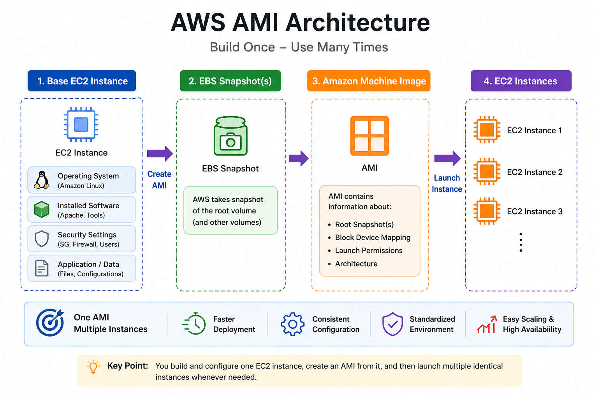
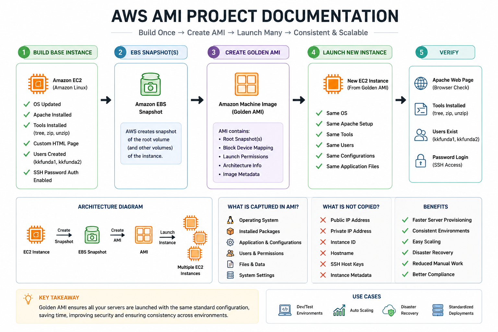

# 🚀 AWS Golden AMI Project

## Build Once – Deploy Many Times

### Project Objective

In this project, we will:

* Launch an Amazon Linux EC2 Instance
* Install Apache Web Server
* Install Required Tools
* Create Linux Users
* Configure SSH Password Authentication
* Create a Golden AMI
* Launch a New EC2 Instance from the AMI
* Verify that everything is copied successfully

---

# 📖 What is a Golden AMI?

A Golden AMI (Amazon Machine Image) is a pre-configured machine image containing:

* Operating System
* Security Baseline
* Installed Software
* User Accounts
* Monitoring Tools
* Application Configurations

Organizations use Golden AMIs to ensure all servers are deployed with the same configuration and standards.

---

# 🏗️ Architecture Diagram

<p align="center">
  
</p>

### Workflow

```text
+------------------------+
| Base EC2 Instance      |
| Amazon Linux           |
| Apache Installed       |
| Users Created          |
| Tools Installed        |
+-----------+------------+
            |
            | Create AMI
            v
+------------------------+
| Golden AMI             |
+-----------+------------+
            |
            | Launch
            v
+------------------------+
| New EC2 Instance       |
| Same Configuration     |
| Same Packages          |
| Same Users             |
+------------------------+
```

---

# 🎯 Benefits of Golden AMI

* Faster Server Deployment
* Consistent Infrastructure
* Reduced Manual Configuration
* Improved Security Compliance
* Easy Scaling
* Better Disaster Recovery

---

# 🖥️ Step 1: Launch Base EC2 Instance

### Configuration

| Setting       | Value             |
| ------------- | ----------------- |
| AMI           | Amazon Linux 2023 |
| Instance Type | t2.micro          |
| Storage       | Default           |
| SSH Port      | 22                |
| HTTP Port     | 80                |

### Tags

```text
Name      : golden-ami-base
Project   : GoldenAMI
Platform  : Linux
```

---

# 🔐 Step 2: Connect to EC2 Instance

```bash
ssh -i my-key.pem ec2-user@<PUBLIC-IP>
```

Switch to root user:

```bash
sudo su -
```

---

# 📦 Step 3: Update Operating System

Amazon Linux 2023

```bash
dnf update -y
```

Amazon Linux 2

```bash
yum update -y
```

---

# 🛠️ Step 4: Install Required Tools

Install:

* tree
* zip
* unzip

```bash
dnf install -y tree zip unzip
```

Verify:

```bash
tree --version
zip -v | head
unzip -v | head
```

---

# 🌐 Step 5: Install Apache Web Server

```bash
dnf install -y httpd
```

Enable Service:

```bash
systemctl enable httpd
```

Start Service:

```bash
systemctl start httpd
```

Verify:

```bash
systemctl status httpd --no-pager
```

---

# 📄 Step 6: Create Sample Web Page

```bash
cat > /var/www/html/index.html << 'EOF'
<!DOCTYPE html>
<html>
<head>
<title>Golden AMI Demo</title>
</head>
<body>

<h1>Golden AMI Demo - Apache is Working</h1>

<p>This server was built from a Golden AMI.</p>

</body>
</html>
EOF
```

Set permissions:

```bash
chmod 644 /var/www/html/index.html
```

Verify:

```bash
curl http://localhost
```

Open Browser:

```text
http://<PUBLIC-IP>
```

---

# 👥 Step 7: Create Linux Users

Create users:

```bash
useradd devopsuser1
useradd devopsuser2
```

Set passwords:

```bash
passwd devopsuser1
passwd devopsuser2
```

Add Sudo Access:

```bash
usermod -aG wheel devopsuser1
```

Verify:

```bash
id devopsuser1
id devopsuser2
```

---

# 🔒 Step 8: Enable SSH Password Authentication

Edit SSH Configuration:

```bash
vi /etc/ssh/sshd_config
```

Update:

```text
PasswordAuthentication yes
PermitRootLogin no
```

Restart SSH:

```bash
systemctl restart sshd
```

Verify:

```bash
systemctl status sshd
```

---

# 🖼️ Step 9: Create Golden AMI

Navigate:

```text
EC2 Console
→ Instances
→ Select Instance
→ Actions
→ Image and Templates
→ Create Image
```

Provide:

```text
Name: golden-ami-v1

Description:
Apache + Tools + Users + SSH Password Authentication
```

---

# 📸 AMI Creation Process

<p align="center">
  
</p>

### What AWS Does

```text
EC2 Instance
     |
     v
EBS Snapshot Created
     |
     v
AMI Registered
     |
     v
Ready to Launch New Instances
```

---

# 🚀 Step 10: Launch Instance from Golden AMI

Navigate:

```text
EC2 Console
→ AMIs
→ Select golden-ami-v1
→ Launch Instance
```

Configuration:

* Same Security Group
* Same Key Pair
* HTTP Port 80
* SSH Port 22

---

# 📸 Launch New Instance

<p align="center">
  
</p>

---

# ✅ Step 11: Verification

### Verify Apache

```bash
systemctl status httpd
```

```bash
curl http://localhost
```

### Verify Installed Packages

```bash
tree
zip -v
unzip -v
```

### Verify Users

```bash
getent passwd devopsuser1
getent passwd devopsuser2
```

### Verify Password Login

```bash
ssh devopsuser1@<NEW-PUBLIC-IP>
```

---

# 🔍 What Gets Copied?

When a new EC2 instance launches from an AMI:

✅ Operating System

✅ Installed Packages

✅ Apache Configuration

✅ Web Content

✅ Linux Users

✅ Application Files

✅ System Configuration

---

# ❌ What Does NOT Get Copied?

* Public IP Address
* Private IP Address
* Instance ID
* Hostname
* Instance Metadata

---

# 🏆 Best Practices

Before creating a production Golden AMI:

* Remove Secrets
* Remove Temporary Files
* Apply Latest Security Patches
* Use IAM Roles
* Enable Monitoring Agents
* Follow Least Privilege Access

---

# 🎓 AWS SAA-C03 Exam Tips

### Question 1

What is a Golden AMI?

**Answer:** A pre-configured AMI containing operating system, software, security settings, and standard configurations.

---

### Question 2

What happens when an AMI is created?

**Answer:** AWS creates EBS snapshots and registers them as an Amazon Machine Image.

---

### Question 3

Which AWS service uses AMIs to launch EC2 instances automatically?

**Answer:** Auto Scaling Group.

---

### Question 4

What is the difference between an AMI and an EBS Snapshot?

| AMI                    | Snapshot                  |
| ---------------------- | ------------------------- |
| Launches EC2 Instances | Backup of EBS Volume      |
| Contains OS            | Does Not Launch Instances |
| Uses Snapshots         | Volume-Level Backup       |

---

🎯 Key Takeaways

✅ Learned how to create a Golden AMI

✅ Installed Apache Web Server

✅ Configured Linux Users

✅ Enabled SSH Password Authentication

✅ Created Custom AMI

✅ Launched EC2 from AMI

✅ Verified Configuration Consistency

✅ Prepared for AWS SAA-C03 Exam Questions

# 🚀 AWS Golden AMI Project

<p align="center">
  
</p>

<p align="center">
  <strong>Build Base EC2 → Create Golden AMI → Launch New Instances → Verify Configuration</strong>
</p>
