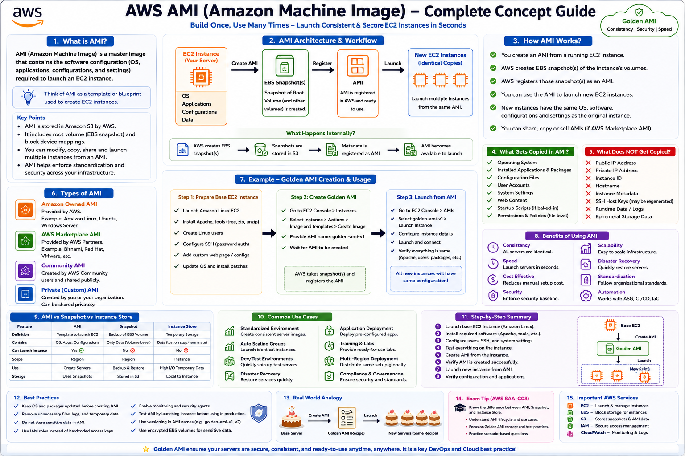

# 🚀 AWS AMI (Amazon Machine Image)

This repository contains notes, hands-on labs, interview questions, and a complete Golden AMI project for AWS.

---

## 📂 Project Structure

```text
AWS-NotesAMI/
│
├── README.md
├── interview-questions.md
├── Machine
├── 01-AWS-AMI.md
├── 02-Golden-AMI-Project.md
│
├── images/
│
└── scripts/
```

---

## 📖 Documents

### 1. AWS AMI Fundamentals

📄 [01-AWS-AMI.md](01-AWS-AMI.md)

Topics Covered:

- What is AMI?
- AMI Components
- AMI Types
- AMI vs Snapshot
- AMI Architecture
- AWS SAA-C03 Exam Notes

---

### 2. Golden AMI Project

📄 [02-Golden-AMI-Project.md](02-Golden-AMI-Project.md)

Project Covers:

- Launch Amazon Linux EC2
- Install Apache Web Server
- Install Required Packages
- Create Linux Users
- Configure SSH Password Authentication
- Create Golden AMI
- Launch Instance from AMI
- Verification Steps

---

### 3. Interview Questions

📄 [interview-questions.md](interview-questions.md)

Includes:

- AMI Interview Questions
- EC2 Interview Questions
- AWS SAA-C03 Exam Questions
- Real-Time Scenarios

---

## 🖼️ Images

All project screenshots and architecture diagrams are stored in:

```text
images/
```

Examples:

```text
images/
├── AWS-AMI-Project-Documentation.png
├── architecture.png
├── create-ami.png
└── launch-instance-from-ami.png
```

---

## ⚙️ Automation Script

Location:

```text
scripts/setup-golden-ami.sh
```

Run:

```bash
chmod +x scripts/setup-golden-ami.sh

sudo ./scripts/setup-golden-ami.sh
```

[3~<h1 align="center">🚀 AWS AMI Complete Concept Guide</h1>

<p align="center">
  
</p>

<p align="center">
  <em>
    Learn AMI Architecture, Golden AMI, Snapshots, Use Cases, Best Practices, and AWS SAA-C03 Exam Concepts.
  </em>
</p>
---

## 🎯 Learning Outcomes

By completing this project, you will learn:

- Amazon Machine Image (AMI)
- Golden AMI Concepts
- EC2 Administration
- Apache Installation
- Linux User Management
- SSH Configuration
- AMI Creation Process
- AWS Best Practices

---

## 👨‍💻 Author

**Newton N**

AWS | DevOps | Linux | Cloud Engineer

🔗 GitHub Repository:
https://github.com/newton9979/Learn_DevOps
