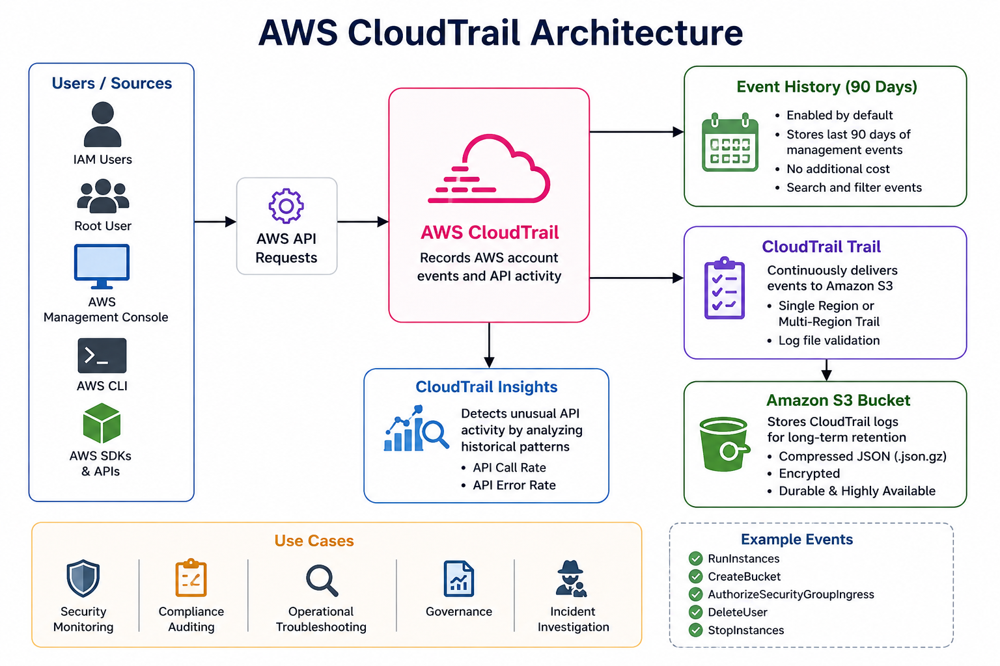

````markdown
# 🏗️ AWS CloudTrail Architecture

## 📌 Overview

AWS CloudTrail records API calls and account activity across your AWS environment. Every action performed by a user, application, or AWS service is captured as an event. These events can be viewed in **Event History** or stored in **Amazon S3** using a CloudTrail Trail for long-term retention and analysis.

---

# 🖼️ Architecture Diagram

<p align="center">
    
</p>

---

# 🔄 CloudTrail Workflow

```text
                 User / IAM User / Root User
                          │
                          ▼
              AWS Management Console / CLI / SDK
                          │
                    AWS API Request
                          │
                          ▼
                 ┌───────────────────┐
                 │ AWS CloudTrail    │
                 └───────────────────┘
                          │
          ┌───────────────┴───────────────┐
          ▼                               ▼
   Event History (90 Days)         CloudTrail Trail
                                           │
                                           ▼
                                   Amazon S3 Bucket
                                           │
                         ┌─────────────────┴─────────────────┐
                         ▼                                   ▼
                  Security Auditing                  Compliance Reports
                         │
                         ▼
                 CloudTrail Insights
```

---

# 🛠️ Architecture Components

## 1. AWS Users

AWS users interact with AWS resources using:

- AWS Management Console
- AWS CLI
- AWS SDK
- AWS APIs

Every action generates an API call.

### Example

- Launch an EC2 instance
- Stop an EC2 instance
- Create an S3 bucket
- Delete a Security Group

---

## 2. AWS API Calls

CloudTrail records almost every supported API request.

Each event contains:

- Event Name
- User Name
- Event Time
- Source IP Address
- AWS Region
- Request Parameters
- Response Elements

---

## 3. AWS CloudTrail

CloudTrail is responsible for recording and processing AWS account activity.

It automatically captures:

- Management Events
- Data Events (Optional)
- Insights Events (Optional)

---

## 4. Event History

Event History is enabled by default.

Features:

- Last 90 days of Management Events
- No configuration required
- No additional cost
- Search and filter events

---

## 5. CloudTrail Trail

A Trail continuously records AWS events and delivers them to an Amazon S3 bucket.

Benefits:

- Long-term storage
- Centralized logging
- Compliance
- Auditing

Trails can be configured for:

- Single Region
- Multi-Region

---

## 6. Amazon S3

CloudTrail stores log files in an S3 bucket.

Example structure:

```text
AWSLogs/
 └── Account-ID/
      └── CloudTrail/
           └── us-east-1/
                └── 2026/
                     └── 06/
                          └── 29/
```

These logs are stored as compressed JSON (`.json.gz`) files.

---

## 7. CloudTrail Insights

CloudTrail Insights detects unusual API activity by comparing current behavior with historical patterns.

Examples:

- Sudden spike in API calls
- Unexpected write operations
- High API error rates

This helps identify potential security issues or operational anomalies.

---

# 📊 End-to-End Example

### Step 1

A user launches an EC2 instance from the AWS Console.

↓

### Step 2

AWS generates a **RunInstances** API call.

↓

### Step 3

CloudTrail records the API request.

↓

### Step 4

The event appears in **Event History**.

↓

### Step 5

If a Trail is configured, the event is also delivered to Amazon S3.

↓

### Step 6

Security teams can review the logs or use them for compliance and auditing.

---

# 📋 CloudTrail Event Flow

```text
User
   │
   ▼
AWS Console
   │
   ▼
AWS API Call
   │
   ▼
CloudTrail
   │
   ├── Event History (90 Days)
   │
   ├── CloudTrail Trail
   │         │
   │         ▼
   │     Amazon S3
   │
   └── CloudTrail Insights
```

---

# 🎯 Key Benefits of the Architecture

- Records AWS API activity automatically
- Provides 90-day Event History
- Stores logs securely in Amazon S3
- Supports governance and compliance
- Detects unusual API activity
- Enables incident investigation
- Improves operational visibility

---

# 📚 Summary

AWS CloudTrail acts as the audit service for your AWS account. Every supported API request made through the AWS Console, CLI, SDK, or services is recorded and can be reviewed through Event History or stored in Amazon S3 for long-term analysis.

Understanding this architecture is essential for implementing secure, compliant, and well-governed AWS environments.
````

