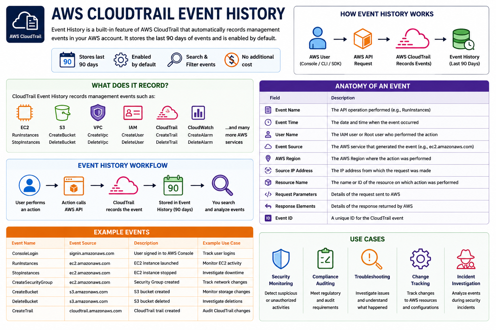

````markdown
# 📜 AWS CloudTrail Event History

## 📌 Objective

The objective of this lab is to understand how **AWS CloudTrail Event History** records AWS management events and helps monitor account activity. In this exercise, you will explore Event History and learn how to view AWS API calls performed in your account.

---

# 📖 What is Event History?

**AWS CloudTrail Event History** is a built-in feature that automatically records **Management Events** in your AWS account.

It allows you to review AWS API activity without creating a CloudTrail Trail.

> **Note:** Event History is enabled by default and stores the last **90 days** of management events at no additional cost.

---

# ✨ Features

- Automatically enabled
- Stores the last 90 days of management events
- No configuration required
- Search and filter events
- Useful for troubleshooting
- Supports security investigations
- Helps with compliance auditing

---

# 🏗️ Event History Workflow

```text
AWS User
    │
    ▼
AWS Console / CLI / SDK
    │
    ▼
AWS API Call
    │
    ▼
AWS CloudTrail
    │
    ▼
Event History (90 Days)
```

---

# 🧪 Hands-on Lab

## Step 1: Open AWS CloudTrail

1. Sign in to the AWS Management Console.
2. Search for **CloudTrail**.
3. Open the **CloudTrail Dashboard**.
4. In the left navigation pane, click **Event History**.

---

## Step 2: View Recorded Events

CloudTrail automatically displays recent management events.

Some common events include:

- ConsoleLogin
- RunInstances
- StopInstances
- CreateSecurityGroup
- CreateBucket
- DeleteBucket
- CreateTrail

You can search or filter events using the search bar.

---

## Step 3: Explore Event Details

Click any event to view detailed information.

Each event contains useful information such as:

- Event Name
- Event Time
- Username
- AWS Service
- AWS Region
- Source IP Address
- Resource Name
- Request Parameters
- Response Elements

---

# 📷 Event History

<p align="center">
    
</p>

---

# 🔍 Example Events

| Event Name | Description |
|------------|-------------|
| ConsoleLogin | User signed in to the AWS Management Console |
| RunInstances | An EC2 instance was launched |
| StopInstances | An EC2 instance was stopped |
| CreateSecurityGroup | A new Security Group was created |
| CreateBucket | A new Amazon S3 bucket was created |
| DeleteBucket | An Amazon S3 bucket was deleted |

---

# 💼 Real-World Use Cases

AWS CloudTrail Event History is commonly used for:

- Security monitoring
- Compliance auditing
- Investigating unauthorized activity
- Tracking infrastructure changes
- Troubleshooting AWS resources
- Reviewing user actions

---

# 🎯 Benefits

- Tracks all supported AWS API calls
- Provides complete visibility into AWS account activity
- Helps identify who performed an action
- Shows when an action occurred
- Displays the source IP address
- Useful for incident response and governance

---

# ✅ Key Learnings

- Event History is enabled by default.
- It stores management events for the last 90 days.
- No CloudTrail Trail is required to use Event History.
- Every AWS API call contains detailed information.
- Event History is one of the most useful tools for monitoring AWS account activity.

---

# 📚 Summary

AWS CloudTrail Event History provides a simple and effective way to monitor AWS account activity. It records management events automatically, making it easy to audit user actions, troubleshoot issues, and investigate security incidents without any additional configuration.
````

