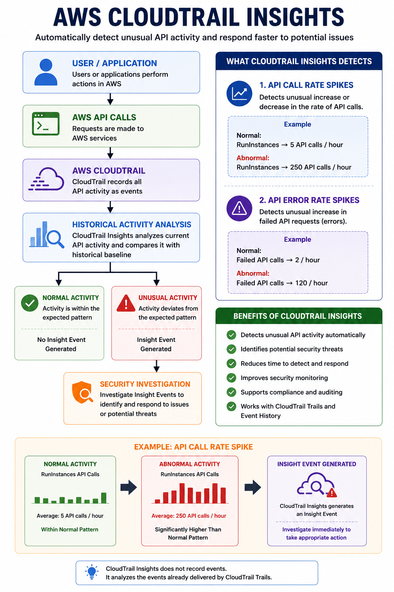

````markdown
# 🔍 AWS CloudTrail Insights

## 📌 Lab Objective

The objective of this lab is to understand **AWS CloudTrail Insights**, how it detects unusual API activity, and how it helps identify potential security incidents or operational anomalies in an AWS environment.

---

# 📖 What is CloudTrail Insights?

**AWS CloudTrail Insights** is a feature of AWS CloudTrail that automatically analyzes your AWS API activity and detects unusual behavior.

Instead of recording every event like Event History or Trails, CloudTrail Insights compares current API activity with historical patterns and highlights anomalies.

> **Key Point:** CloudTrail Insights helps identify unexpected API activity that may indicate security threats or operational issues.

---

# 🎯 Why Use CloudTrail Insights?

CloudTrail Insights helps you:

- Detect unusual API activity
- Identify sudden spikes in API calls
- Detect abnormal API error rates
- Improve security monitoring
- Reduce investigation time
- Support compliance and auditing

---

# 🏗️ How CloudTrail Insights Works

```text
                User / Application
                        │
                        ▼
                AWS API Requests
                        │
                        ▼
                AWS CloudTrail
                        │
             Records API Activity
                        │
                        ▼
        Compares Current Activity
          With Historical Baseline
                        │
          ┌─────────────┴─────────────┐
          ▼                           ▼
 Normal Activity              Unusual Activity
          │                           │
          ▼                           ▼
    No Insight Event          Insight Event Generated
```

---

# 🧪 Hands-on Lab

## Step 1: Open AWS CloudTrail

1. Sign in to the AWS Management Console.
2. Search for **CloudTrail**.
3. Open the CloudTrail service.
4. Select **Trails**.
5. Open your existing Trail.

---

## Step 2: Enable Insights

Click **Edit** on the Trail.

Under **Insights Events**:

✅ Enable **Insights Events**

Choose:

- API Call Rate
- API Error Rate (Optional)

Click **Save Changes**.

---

## Step 3: Generate Activity

To help generate CloudTrail activity, perform actions such as:

- Launch an EC2 instance
- Stop an EC2 instance
- Create a Security Group
- Create an Amazon S3 bucket
- Delete a test resource

CloudTrail continuously analyzes API activity and compares it with the historical baseline.

---

# 📷 CloudTrail Insights

<p align="center">
    
</p>

---

# 🔍 Insight Types

## 1️⃣ API Call Rate

Detects unusual increases or decreases in AWS API calls.

### Example

Normal activity:

```
RunInstances

5 API Calls / Hour
```

Unexpected activity:

```
RunInstances

250 API Calls / Hour
```

CloudTrail generates an **Insight Event** because the activity differs significantly from the historical pattern.

---

## 2️⃣ API Error Rate

Detects an unusual increase in failed AWS API requests.

### Example

Normal:

```
2 Failed API Calls
```

Unexpected:

```
120 Failed API Calls
```

This could indicate:

- Misconfigured applications
- Permission issues
- Automation failures
- Potential security attacks

---

# 💼 Real-World Example

Imagine an AWS account normally creates **5 EC2 instances per day**.

One evening, an automated script suddenly launches **300 EC2 instances** within a few minutes.

CloudTrail Insights detects this unusual increase in API activity and generates an Insight Event.

The security team investigates the event and discovers that an automation script was incorrectly configured.

Without CloudTrail Insights, this abnormal behavior might have gone unnoticed until it resulted in unnecessary costs or operational issues.

---

# 📊 Benefits

- Detects abnormal AWS activity automatically
- Reduces manual monitoring effort
- Improves incident response
- Helps identify compromised accounts
- Supports compliance requirements
- Enhances AWS security visibility

---

# ⚠️ Best Practices

- Enable CloudTrail Insights on production Trails.
- Monitor generated Insight Events regularly.
- Combine CloudTrail Insights with Amazon CloudWatch alarms.
- Secure CloudTrail logs using Amazon S3 encryption.
- Follow the principle of least privilege with IAM.

---

# 📋 CloudTrail Insights vs Event History

| Feature | Event History | CloudTrail Insights |
|----------|---------------|--------------------|
| Records API Calls | ✅ Yes | ❌ No |
| Detects Anomalies | ❌ No | ✅ Yes |
| Uses Historical Baseline | ❌ No | ✅ Yes |
| Helps Investigate Security Events | Limited | Excellent |
| Detects API Spikes | ❌ No | ✅ Yes |

---

# 🎯 Key Learnings

- CloudTrail Insights is an anomaly detection feature.
- It compares current AWS API activity with historical behavior.
- It detects unusual API call rates and API error rates.
- It improves security monitoring and operational visibility.
- It works alongside CloudTrail Trails and Event History.

---

# Design Layout
             AWS CLOUDTRAIL INSIGHTS

                User / Application
                        │
                        ▼
                  AWS API Calls
                        │
                        ▼
                 AWS CloudTrail
                        │
          Historical Activity Analysis
                        │
          ┌─────────────┴─────────────┐
          ▼                           ▼
   Normal Activity             Unusual Activity
                                     │
                                     ▼
                         CloudTrail Insight Event
                                     │
                                     ▼
                     Security Investigation

────────────────────────────────────────────

✔ Detects API Call Rate Spikes

✔ Detects API Error Rate Spikes

✔ Improves Security Monitoring

✔ Supports Compliance

✔ Faster Incident Response

────────────────────────────────────────────

Example

Normal:
RunInstances → 5/hour

↓

Abnormal:
RunInstances → 250/hour

↓

Insight Event Generated 🚨

# 📚 Summary

AWS CloudTrail Insights extends CloudTrail by automatically detecting unusual AWS API activity. Instead of simply recording events, it analyzes behavior over time and generates Insight Events whenever activity deviates from the normal baseline. This helps organizations quickly identify security incidents, operational issues, and unexpected changes in their AWS environment.
````

