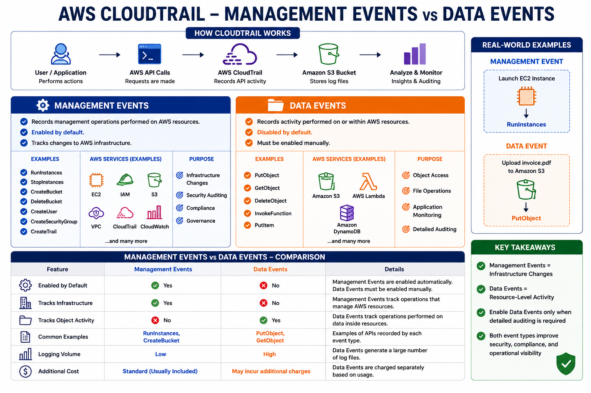

# 📝 AWS CloudTrail Management Events vs Data Events

## 📌 Lab Objective

The objective of this lab is to understand the difference between **Management Events** and **Data Events** in AWS CloudTrail. You will learn what each event type records, when to enable them, and their real-world use cases.

---

# 📖 What are CloudTrail Events?

AWS CloudTrail records AWS API activity as **events**. These events provide visibility into actions performed by users, applications, and AWS services.

CloudTrail supports two primary event types:

* **Management Events**
* **Data Events**

Understanding the difference helps you configure CloudTrail efficiently and control logging costs.

---

# 🏗️ CloudTrail Event Types

```text
                AWS CloudTrail
                      │
         ┌────────────┴────────────┐
         ▼                         ▼
 Management Events          Data Events
         │                         │
         ▼                         ▼
 Account Operations        Resource Operations
```

---

# 🔹 Management Events

Management Events record operations that **manage AWS resources**.

These events are enabled by default when creating a CloudTrail Trail.

### Examples

* Launch an EC2 instance
* Stop an EC2 instance
* Create an S3 bucket
* Delete an S3 bucket
* Create an IAM user
* Modify a Security Group
* Create a CloudTrail Trail

---

## Common Management Event APIs

| AWS Service | Example API         |
| ----------- | ------------------- |
| EC2         | RunInstances        |
| EC2         | StopInstances       |
| IAM         | CreateUser          |
| S3          | CreateBucket        |
| CloudTrail  | CreateTrail         |
| VPC         | CreateSecurityGroup |

---

# 🔹 Data Events

Data Events record operations performed **inside AWS resources**.

Unlike Management Events, Data Events are **disabled by default** because they can generate a large number of logs.

You must explicitly enable them.

---

## Examples

Amazon S3

* Upload Object
* Download Object
* Delete Object

AWS Lambda

* Invoke Function

Amazon DynamoDB

* Read Item
* Write Item

---

## Common Data Event APIs

| AWS Service | Example API    |
| ----------- | -------------- |
| Amazon S3   | PutObject      |
| Amazon S3   | GetObject      |
| Amazon S3   | DeleteObject   |
| AWS Lambda  | InvokeFunction |
| DynamoDB    | PutItem        |

---

# 📷 Management Events vs Data Events

<p align="center">
    
</p>

---

# 🧪 Hands-on Lab

## Step 1: Open CloudTrail

1. Sign in to the AWS Management Console.
2. Open **CloudTrail**.
3. Select **Trails**.
4. Open your existing Trail.
5. Click **Edit**.

---

## Step 2: Configure Event Types

During Trail configuration, you can choose:

### Management Events

Enable:

* ✅ Read Events
* ✅ Write Events

---

### Data Events

Select resources to monitor, such as:

* Amazon S3 Buckets
* AWS Lambda Functions
* DynamoDB Tables

Choose the required operations:

* Read
* Write
* Read/Write

---

## Step 3: Save Changes

Click **Save Changes**.

CloudTrail will begin recording the selected event types.

---

# 💼 Real-World Example

### Management Event

A system administrator launches a new EC2 instance.

CloudTrail records:

```
RunInstances
```

This is a **Management Event** because it changes AWS infrastructure.

---

### Data Event

A user uploads a file named **invoice.pdf** into an Amazon S3 bucket.

CloudTrail records:

```
PutObject
```

This is a **Data Event** because it operates on data stored inside the bucket.

---

# 📊 Management Events vs Data Events

| Feature                       | Management Events          | Data Events                  |
| ----------------------------- | -------------------------- | ---------------------------- |
| Enabled by Default            | ✅ Yes                      | ❌ No                         |
| Records Resource Management   | ✅ Yes                      | ❌ No                         |
| Records Object-Level Activity | ❌ No                       | ✅ Yes                        |
| Examples                      | RunInstances, CreateBucket | PutObject, GetObject         |
| Logging Volume                | Low                        | High                         |
| Additional Charges            | Usually Included           | Additional charges may apply |

---

# 🎯 When to Use Each

### Use Management Events

* Infrastructure monitoring
* Security auditing
* Compliance
* Change tracking

---

### Use Data Events

* Monitor S3 object access
* Audit Lambda function invocations
* Track DynamoDB item operations
* Meet detailed compliance requirements

---

# ⚠️ Best Practices

* Always enable **Management Events**.
* Enable **Data Events** only for resources that require detailed auditing.
* Monitor storage costs because Data Events can generate a large number of logs.
* Store CloudTrail logs securely in Amazon S3.
* Use IAM policies to protect CloudTrail log access.

---

# 🎯 Key Learnings

* CloudTrail supports **Management Events** and **Data Events**.
* Management Events record infrastructure changes.
* Data Events record operations on data stored within AWS resources.
* Data Events must be enabled manually.
* Choosing the correct event type improves security while controlling costs.

---

# 📚 Summary

AWS CloudTrail provides two categories of event logging. **Management Events** capture actions that create, modify, or delete AWS resources, while **Data Events** capture object-level activity within services such as Amazon S3, AWS Lambda, and DynamoDB. Understanding the difference helps you design secure, cost-effective logging strategies for your AWS environment.

