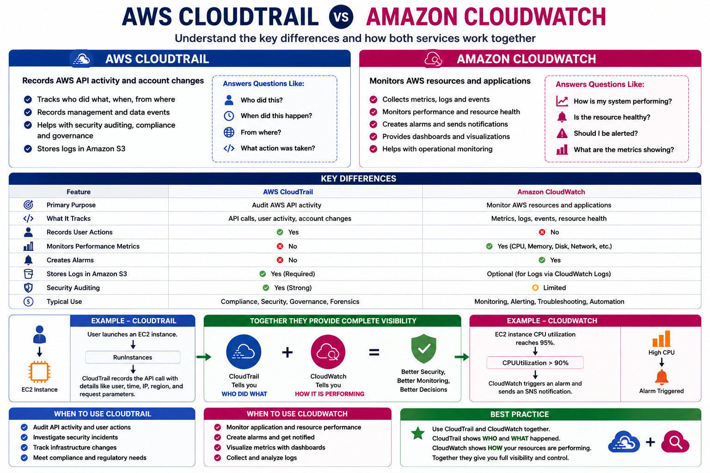

# ☁️ AWS CloudTrail vs Amazon CloudWatch

## 📌 Lab Objective

The objective of this lab is to understand the differences between **AWS CloudTrail** and **Amazon CloudWatch**. Although both services help monitor AWS environments, they serve different purposes. By the end of this lab, you will know when to use each service and how they complement each other.

---

# 📖 Introduction

AWS provides several monitoring and logging services, with **CloudTrail** and **CloudWatch** being the most commonly used.

At first glance they may appear similar, but they solve different problems:

* **CloudTrail** records **who did what** in your AWS account.
* **CloudWatch** monitors **how your AWS resources are performing**.

Together, they provide complete visibility into your AWS environment.

---

# 🏗️ Service Overview

## AWS CloudTrail

AWS CloudTrail records **AWS API calls** and account activity.

It helps answer questions such as:

* Who launched an EC2 instance?
* Who deleted an S3 bucket?
* When was an IAM user created?
* Which IP address made the request?

CloudTrail is mainly used for:

* Security auditing
* Compliance
* Governance
* Change tracking
* Incident investigation

---

## Amazon CloudWatch

Amazon CloudWatch monitors AWS resources and applications.

It collects:

* Metrics
* Logs
* Events
* Alarms

CloudWatch helps answer questions such as:

* Is CPU utilization too high?
* Is memory usage increasing?
* Is my application generating errors?
* Should an alarm notify my team?

CloudWatch is mainly used for:

* Performance monitoring
* Resource health
* Alerting
* Automation
* Operational monitoring

---

# 📷 CloudTrail vs CloudWatch

<p align="center">
    
</p>

---

# 🔍 Key Differences

| Feature                  | AWS CloudTrail         | Amazon CloudWatch          |
| ------------------------ | ---------------------- | -------------------------- |
| Primary Purpose          | Audit AWS API activity | Monitor AWS resources      |
| Tracks                   | API Calls              | Metrics, Logs, Events      |
| Records User Actions     | ✅ Yes                  | ❌ No                       |
| Monitors CPU & Memory    | ❌ No                   | ✅ Yes                      |
| Creates Alarms           | ❌ No                   | ✅ Yes                      |
| Stores Logs in Amazon S3 | ✅ Yes                  | Optional (CloudWatch Logs) |
| Security Auditing        | ✅ Yes                  | Limited                    |
| Performance Monitoring   | ❌ No                   | ✅ Yes                      |

---

# 🧪 Hands-on Examples

## Example 1 – CloudTrail

A user launches an EC2 instance.

CloudTrail records:

```text
RunInstances
```

The event includes:

* Username
* Event Time
* AWS Region
* Source IP Address
* Request Parameters
* Response Details

CloudTrail answers:

> **Who created the EC2 instance?**

---

## Example 2 – CloudWatch

The EC2 instance CPU utilization reaches **95%**.

CloudWatch:

* Collects the CPU metric
* Compares it against a threshold
* Triggers an alarm
* Sends an SNS notification (if configured)

CloudWatch answers:

> **Is the EC2 instance healthy and performing well?**

---

# 💼 Real-World Scenario

Imagine an application suddenly becomes unavailable.

### Step 1 – CloudWatch

CloudWatch detects:

* High CPU utilization
* Increased error rate
* Alarm triggered

↓

### Step 2 – CloudTrail

CloudTrail shows:

```
TerminateInstances
```

An administrator accidentally terminated the EC2 instance.

Together, CloudWatch identifies **the problem**, while CloudTrail identifies **who caused it**.

---

# 🎯 When to Use CloudTrail

Use CloudTrail when you need to:

* Audit AWS API activity
* Investigate security incidents
* Track infrastructure changes
* Meet compliance requirements
* Monitor IAM user actions

---

# 🎯 When to Use CloudWatch

Use CloudWatch when you need to:

* Monitor application performance
* Track EC2 metrics
* Monitor Lambda executions
* Create alarms
* Collect logs
* Build dashboards

---

# ⚡ Best Practice

Use **CloudTrail** and **CloudWatch** together.

CloudTrail tells you:

> **Who performed the action?**

CloudWatch tells you:

> **How the resource is performing?**

Combining both services provides complete operational visibility and strengthens security monitoring.

---

# 📚 Summary

AWS CloudTrail and Amazon CloudWatch are complementary services rather than competing ones. CloudTrail records AWS API activity for auditing and compliance, while CloudWatch monitors the health, performance, and operational metrics of AWS resources. Using both services together helps organizations build secure, reliable, and well-monitored AWS environments.

---

# 🎯 Key Takeaways

* CloudTrail records **AWS API calls and user activity**.
* CloudWatch monitors **metrics, logs, and alarms**.
* CloudTrail is used for **security and auditing**.
* CloudWatch is used for **performance and monitoring**.
* Together they provide complete visibility into your AWS environment.

