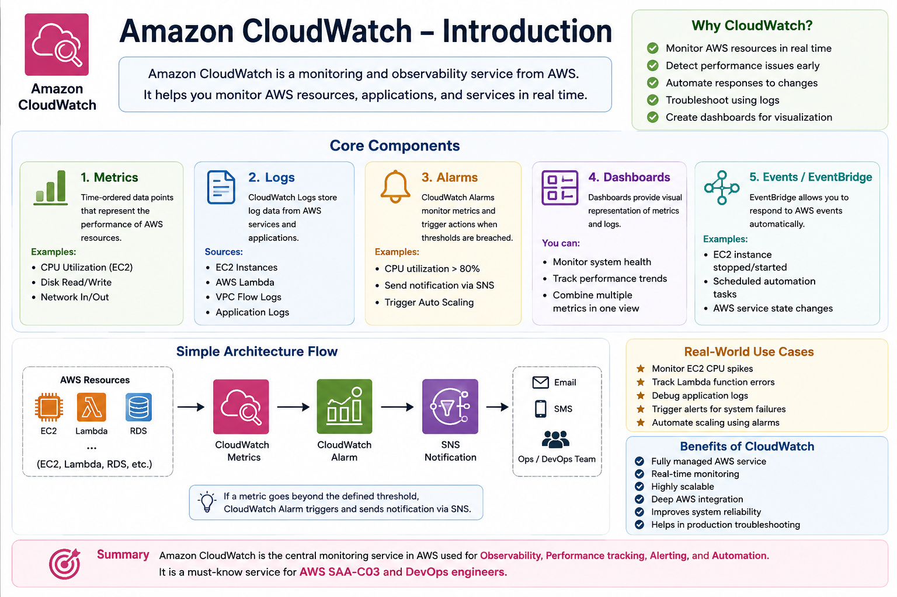

# ☁️ Amazon CloudWatch – Introduction

## 📌 Overview

Amazon CloudWatch is a **monitoring and observability service** provided by AWS.  
It helps you monitor AWS resources, applications, and services in real time.

CloudWatch collects and tracks data to help you understand system performance, detect issues, and respond automatically.

---

## 🎯 Why CloudWatch?

In modern cloud environments, systems are distributed across multiple services. CloudWatch helps you:

- Monitor AWS resources in real time
- Detect system performance issues early
- Automate responses to system changes
- Troubleshoot application problems using logs
- Create dashboards for visualization

---

## ⚙️ Core Components of CloudWatch

### 📊 1. Metrics
Metrics are time-ordered data points that represent the performance of AWS resources.

Examples:
- CPU Utilization (EC2)
- Disk Read/Write
- Network In/Out

---

### 📄 2. Logs
CloudWatch Logs store log data from AWS services and applications.

Common sources:
- EC2 instances
- AWS Lambda functions
- VPC Flow Logs
- Application logs

---

### 🚨 3. Alarms
CloudWatch Alarms monitor metrics and trigger actions when thresholds are breached.

Example:
- CPU utilization > 80%
- Send notification via SNS
- Trigger Auto Scaling

---

### 📊 4. Dashboards
Dashboards provide visual representation of metrics and logs.

You can:
- Monitor system health
- Track performance trends
- Combine multiple metrics in one view

---

### ⚡ 5. Events / EventBridge
EventBridge allows you to respond to AWS events automatically.

Examples:
- EC2 instance stopped/started
- Scheduled automation tasks
- AWS service state changes

---

## 🏗️ Simple Architecture Flow
AWS Resources (EC2, Lambda, RDS)
↓
CloudWatch Metrics
↓
CloudWatch Alarm
↓
SNS Notification

[3~
👉 This helps automate monitoring and alerting in AWS.

---

## 💡 Real-World Use Cases

- Monitor EC2 CPU spikes
- Track Lambda function errors
- Debug application logs
- Trigger alerts for system failures
- Automate scaling using alarms

---

## 🔥 Benefits of CloudWatch

- Fully managed AWS service
- Real-time monitoring
- Highly scalable
- Deep AWS integration
- Improves system reliability
- Helps in production troubleshooting

---

## 📌 Summary

Amazon CloudWatch is the **central monitoring service in AWS** used for:

- Observability
- Performance tracking
- Alerting
- Automation

It is a **must-know service for AWS SAA-C03 and DevOps engineers**.
<h2 align="center">☁️ Amazon CloudWatch Overview</h2>

  

---
