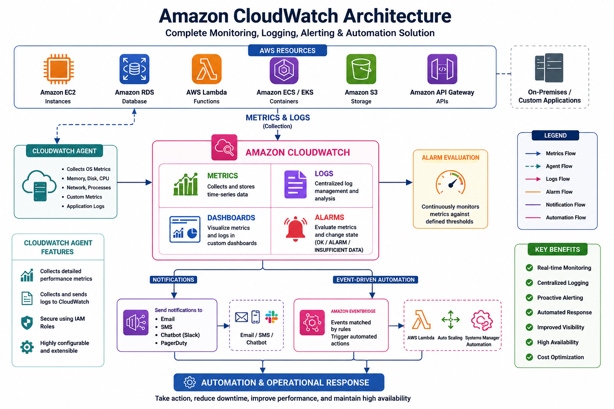

# 🏗️ Amazon CloudWatch Architecture

## 📖 Overview

Amazon CloudWatch is a fully managed monitoring and observability service that collects, processes, stores, and visualizes operational data from AWS resources, applications, and on-premises servers.

The CloudWatch architecture consists of several components working together to monitor infrastructure, collect logs, generate alarms, and automate operational tasks.

Understanding this architecture helps you design highly available, scalable, and observable cloud environments.

---

# 🎯 CloudWatch Architecture Components

The main building blocks of Amazon CloudWatch are:

```
AWS Resources
       │
       ▼
CloudWatch Agent / AWS Services
       │
       ▼
CloudWatch Metrics & Logs
       │
       ▼
CloudWatch Alarms
       │
       ▼
SNS / EventBridge
       │
       ▼
Automation & Notifications
```

---

# 🏛 High-Level Architecture

```
                +----------------------+
                |   AWS Resources      |
                |----------------------|
                | EC2                 |
                | RDS                 |
                | Lambda              |
                | ECS / EKS           |
                | S3                  |
                | API Gateway         |
                +----------+-----------+
                           |
                           |
                Metrics & Logs
                           |
                           ▼
               +----------------------+
               | Amazon CloudWatch    |
               |----------------------|
               | Metrics              |
               | Logs                 |
               | Dashboards           |
               | Alarms               |
               +----------+-----------+
                           |
             +-------------+--------------+
             |                            |
             ▼                            ▼
      Amazon SNS                  Amazon EventBridge
             |                            |
             ▼                            ▼
 Email / SMS / Chatbot          Lambda / SSM / Auto Scaling
```

---

# 🔍 Step 1 – Data Collection

CloudWatch receives monitoring data from multiple sources.

### AWS Services

Many AWS services automatically publish metrics to CloudWatch, including:

* Amazon EC2
* Amazon RDS
* AWS Lambda
* Amazon ECS
* Amazon EKS
* Elastic Load Balancer
* Amazon API Gateway
* Amazon DynamoDB

No additional configuration is required for basic metrics.

---

### CloudWatch Agent

Some operating system metrics are **not collected by default**.

To collect them, install the **CloudWatch Agent** on your EC2 instance.

The CloudWatch Agent collects:

* Memory utilization
* Disk utilization
* Disk I/O
* Swap usage
* Running processes
* Custom application metrics

The agent securely sends this data to CloudWatch using IAM permissions.

---

# 📊 Step 2 – Metrics Storage

A metric is a time-ordered set of data points representing the performance of a resource.

Examples include:

| Resource | Metric           |
| -------- | ---------------- |
| EC2      | CPUUtilization   |
| EC2      | NetworkIn        |
| EC2      | NetworkOut       |
| ALB      | RequestCount     |
| Lambda   | Invocations      |
| Lambda   | Errors           |
| RDS      | FreeStorageSpace |

CloudWatch stores these metrics and makes them available for graphing, dashboards, and alarms.

---

# 📜 Step 3 – Log Collection

CloudWatch Logs centralizes log management.

Examples of logs include:

* Application logs
* Web server logs
* System logs
* Lambda logs
* Container logs
* VPC Flow Logs
* CloudTrail logs

Logs are organized into:

```
Log Group
    ├── Log Stream 1
    ├── Log Stream 2
    ├── Log Stream 3
```

Each Log Stream contains chronological log events.

---

# 🚨 Step 4 – CloudWatch Alarms

CloudWatch continuously evaluates metrics.

Example:

```
CPU Utilization > 80%

↓

Alarm State = ALARM

↓

Trigger Action
```

Possible actions include:

* Send email
* Send SMS
* Trigger Lambda
* Execute Auto Scaling
* Recover EC2 instance
* Create EventBridge event

---

# 📈 Step 5 – Dashboards

Dashboards provide a centralized view of your AWS environment.

Widgets can display:

* Line graphs
* Number widgets
* Bar charts
* Stacked area graphs
* Text widgets

Example dashboard:

```
Production Dashboard

CPU Usage

Memory Usage

Network Traffic

Lambda Errors

Database Storage

Application Latency
```

Operations teams can monitor multiple services from a single screen.

---

# ⚡ Step 6 – Event Processing

CloudWatch integrates with Amazon EventBridge.

When an event occurs:

```
Alarm Triggered

↓

EventBridge Rule

↓

Lambda Function

↓

Restart Service

OR

Create Ticket

OR

Notify Team
```

This enables event-driven automation.

---

# 🔄 CloudWatch Monitoring Workflow

```
AWS Resource

↓

Metrics Generated

↓

CloudWatch Receives Metrics

↓

Metrics Stored

↓

Alarm Evaluated

↓

Alarm Triggered

↓

SNS Notification

↓

Administrator Receives Alert
```

---

# 📡 CloudWatch Agent Architecture

```
EC2 Instance

↓

CloudWatch Agent

↓

IAM Role

↓

CloudWatch API

↓

CloudWatch Metrics

↓

Dashboard / Alarm
```

Without the CloudWatch Agent, EC2 publishes only default infrastructure metrics such as CPU and network usage.

---

# 🔐 IAM Integration

CloudWatch uses IAM to securely access AWS resources.

Typical permissions include:

* cloudwatch:PutMetricData
* logs:CreateLogGroup
* logs:CreateLogStream
* logs:PutLogEvents
* logs:DescribeLogStreams

The CloudWatch Agent uses an IAM role attached to the EC2 instance.

---

# 🌎 Multi-Region Monitoring

CloudWatch supports monitoring resources across multiple AWS Regions.

You can create dashboards that combine metrics from:

* us-east-1
* us-west-2
* eu-west-1
* ap-south-1

This simplifies monitoring for global applications.

---

# 🏢 Cross-Account Monitoring

Organizations often use multiple AWS accounts.

CloudWatch can aggregate monitoring data across accounts using cross-account observability, allowing centralized monitoring from a single account.


<p align="center">
  
</p>
---

# 🛠 Real-World Architecture Example

An online shopping application includes:

* Application Load Balancer
* Auto Scaling Group
* EC2 instances
* Amazon RDS
* AWS Lambda
* Amazon S3

Monitoring workflow:

1. EC2 sends CPU metrics.
2. CloudWatch Agent sends memory and disk metrics.
3. Lambda sends invocation metrics.
4. ALB publishes request count and latency.
5. RDS publishes storage metrics.
6. CloudWatch displays dashboards.
7. Alarms notify administrators.
8. EventBridge triggers automation.
9. Auto Scaling launches additional instances during traffic spikes.

---

# ✅ Best Practices

* Install the CloudWatch Agent on all EC2 instances.
* Organize logs using meaningful Log Groups.
* Use dashboards for production monitoring.
* Configure alarms for critical resources.
* Enable log retention policies.
* Use SNS for notifications.
* Automate remediation with EventBridge and Lambda.
* Follow least-privilege IAM principles.
* Monitor costs by avoiding unnecessary high-resolution metrics.

---

# 🎓 AWS SAA-C03 Exam Tips

* CloudWatch automatically collects default metrics from many AWS services.
* Memory and disk metrics require the CloudWatch Agent.
* CloudWatch Logs and Metrics are separate services within CloudWatch.
* Alarms monitor metrics—not logs directly.
* EventBridge enables event-driven automation.
* Dashboards can display metrics from multiple Regions.
* CloudWatch is used for monitoring, while CloudTrail is used for auditing API activity.

---

# 📝 Key Takeaways

* Amazon CloudWatch is the central monitoring service for AWS.
* Metrics, logs, alarms, dashboards, and events work together to provide complete observability.
* The CloudWatch Agent extends monitoring by collecting operating system metrics.
* CloudWatch integrates with Amazon SNS, EventBridge, Lambda, Auto Scaling, and many other AWS services.
* A well-designed CloudWatch architecture improves reliability, reduces downtime, and enables proactive operations.

---

# 📚 What's Next?

In the next chapter, **03-Metrics.md**, we will explore:

* Standard Metrics
* Detailed Monitoring
* Custom Metrics
* Namespaces
* Dimensions
* Statistics
* Metric Math
* High-Resolution Metrics
* Hands-on EC2 Monitoring
* AWS CLI Examples

