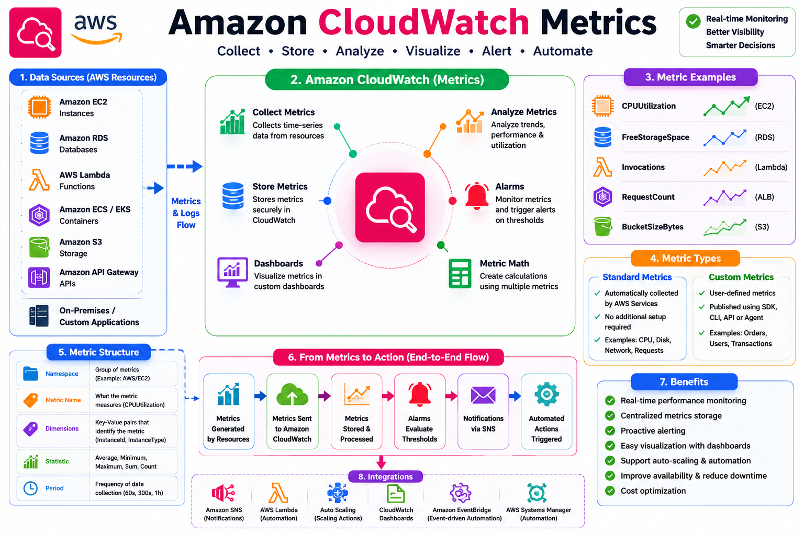

# 📊 Amazon CloudWatch Metrics

## 📖 What are CloudWatch Metrics?

A **CloudWatch Metric** is a time-ordered set of data points that represents the performance or utilization of an AWS resource or application over time.

Metrics help you monitor the health, performance, and availability of your infrastructure by continuously collecting numerical data.

Each metric consists of values recorded over time, making it possible to visualize trends, detect anomalies, create alarms, and automate operational responses.

---

# 🎯 Why Are Metrics Important?

CloudWatch Metrics enable you to:

* Monitor infrastructure health
* Identify performance bottlenecks
* Detect resource failures
* Trigger automated actions
* Build dashboards
* Analyze historical performance
* Improve application reliability
* Optimize AWS costs

Without metrics, it is impossible to understand how your applications and infrastructure are performing.

---

# 🏗 How CloudWatch Metrics Work

<p align="center">
  
</p>

### Monitoring Workflow

```text
AWS Resource
      │
      ▼
Generate Metrics
      │
      ▼
Amazon CloudWatch
      │
      ├── Store Metrics
      ├── Visualize Graphs
      ├── Create Alarms
      └── Display Dashboards
```

---

# 📦 Types of CloudWatch Metrics

Amazon CloudWatch supports two main types of metrics.

## 1. Standard Metrics

Standard Metrics are automatically collected by AWS services.

Examples:

| AWS Service               | Metrics                               |
| ------------------------- | ------------------------------------- |
| Amazon EC2                | CPUUtilization, NetworkIn, NetworkOut |
| Amazon RDS                | CPUUtilization, FreeStorageSpace      |
| AWS Lambda                | Invocations, Errors, Duration         |
| Application Load Balancer | RequestCount, TargetResponseTime      |
| Amazon S3                 | BucketSizeBytes, NumberOfObjects      |

No additional configuration is required.

---

## 2. Custom Metrics

Custom Metrics are user-defined metrics that are published to CloudWatch.

Examples:

* Active Users
* Orders Processed
* Application Response Time
* Queue Length
* Cache Hit Ratio
* Business Transactions

Applications can publish custom metrics using:

* AWS SDK
* AWS CLI
* CloudWatch API
* CloudWatch Agent

---

# 📂 Namespaces

A **Namespace** is a container that groups related metrics.

AWS uses predefined namespaces.

Examples:

| Namespace          | Description                       |
| ------------------ | --------------------------------- |
| AWS/EC2            | EC2 Metrics                       |
| AWS/RDS            | RDS Metrics                       |
| AWS/Lambda         | Lambda Metrics                    |
| AWS/S3             | Amazon S3 Metrics                 |
| AWS/ApplicationELB | Application Load Balancer Metrics |

Custom applications should use their own namespace.

Example:

```text
Newton/Application
```

---

# 🏷 Dimensions

Dimensions are key-value pairs that uniquely identify a metric.

Example:

| Metric         | Dimension                      |
| -------------- | ------------------------------ |
| CPUUtilization | InstanceId=i-1234567890abcdef0 |

Multiple dimensions can be attached to a metric.

Example:

```text
Environment = Production
Application = E-Commerce
Region = ap-south-1
```

Dimensions help filter and organize monitoring data.

---

# 📈 Statistics

CloudWatch calculates different statistical values from collected metrics.

| Statistic   | Description                     |
| ----------- | ------------------------------- |
| Average     | Mean value over time            |
| Minimum     | Lowest value                    |
| Maximum     | Highest value                   |
| Sum         | Total value                     |
| SampleCount | Number of collected data points |

These statistics are displayed in graphs and dashboards.

---

# ⏱ Periods

A **Period** defines how often CloudWatch aggregates metric data.

Common periods:

* 1 minute
* 5 minutes
* 15 minutes
* 30 minutes
* 1 hour

Smaller periods provide more detailed monitoring but may increase costs.

---

# ⚡ High-Resolution Metrics

CloudWatch supports high-resolution metrics with **1-second granularity**.

Benefits:

* Faster monitoring
* Faster alarm evaluation
* Better visibility for critical workloads

Use cases:

* Financial applications
* Gaming platforms
* Real-time analytics
* High-performance APIs

---

# 📊 Metric Graphs

CloudWatch automatically generates graphs for metrics.

Example:

```text
CPU Utilization

100% ┤
 80% ┤          ████
 60% ┤       ████████
 40% ┤    ███████████
 20% ┤ ██████████████
  0% └──────────────────
      Time →
```

Graphs help visualize trends over time.

---

# 📐 Metric Math

Metric Math allows calculations using one or more metrics.

Examples:

* Average CPU across multiple EC2 instances
* Total Network Traffic
* Error Percentage
* Request Success Rate

Example:

```text
Error Rate = (Errors / Invocations) × 100
```

---

# 💻 Hands-on Example: Monitor EC2 CPU Utilization

### Step 1

Open the AWS Management Console.

### Step 2

Navigate to:

```text
CloudWatch → Metrics
```

### Step 3

Select:

```text
AWS/EC2
```

### Step 4

Choose your EC2 instance.

### Step 5

Select:

```text
CPUUtilization
```

### Step 6

View the graph and analyze CPU usage over time.

---

# 🖥 AWS CLI Example

List available metrics:

```bash
aws cloudwatch list-metrics --namespace AWS/EC2
```

Get CPU utilization:

```bash
aws cloudwatch get-metric-statistics \
--namespace AWS/EC2 \
--metric-name CPUUtilization \
--dimensions Name=InstanceId,Value=i-xxxxxxxxxxxxxxxxx \
--statistics Average \
--period 300 \
--start-time 2026-06-01T00:00:00Z \
--end-time 2026-06-01T01:00:00Z
```

---

# 🌍 Real-World Use Cases

* Monitor EC2 CPU usage.
* Track RDS storage consumption.
* Analyze Lambda invocation counts.
* Monitor API Gateway latency.
* Measure application response times.
* Monitor custom business KPIs.
* Detect traffic spikes.
* Support Auto Scaling decisions.

---

# 💡 Best Practices

* Use meaningful namespaces for custom metrics.
* Add dimensions for easier filtering.
* Monitor only necessary metrics to control costs.
* Use high-resolution metrics only when required.
* Create alarms for critical metrics.
* Visualize important metrics on dashboards.
* Regularly review metric trends.

---

# 🎓 AWS SAA-C03 Exam Tips

* Metrics are numerical values collected over time.
* Many AWS services publish metrics automatically.
* Custom metrics can be published using the CloudWatch API.
* Dimensions uniquely identify metric data.
* Namespaces organize metrics.
* Statistics include Average, Minimum, Maximum, Sum, and SampleCount.
* High-resolution metrics support 1-second granularity.
* Alarms are created using CloudWatch Metrics.

---

# ❓ Interview Questions

### 1. What is a CloudWatch Metric?

### 2. What is the difference between Standard and Custom Metrics?

### 3. What is a Namespace?

### 4. What are Dimensions?

### 5. Why are Statistics used?

### 6. What is Metric Math?

### 7. What are High-Resolution Metrics?

### 8. Which AWS services automatically publish metrics?

### 9. How can you publish custom metrics?

### 10. How are Metrics used with CloudWatch Alarms?

---

# 📝 Key Takeaways

* CloudWatch Metrics provide real-time visibility into AWS resources and applications.
* Metrics are the foundation for dashboards, alarms, and automated operations.
* AWS services automatically publish standard metrics.
* Custom metrics enable monitoring of application-specific data.
* Proper use of namespaces, dimensions, statistics, and periods improves observability.
* Understanding CloudWatch Metrics is essential for AWS certification and real-world DevOps operations.

---

# 📚 What's Next?

In the next chapter, **04-CloudWatch-Logs.md**, you will learn:

* CloudWatch Logs
* Log Groups
* Log Streams
* Log Retention
* CloudWatch Logs Insights
* Metric Filters
* Subscription Filters
* EC2 & Lambda Log Monitoring
* Troubleshooting Log Collection

