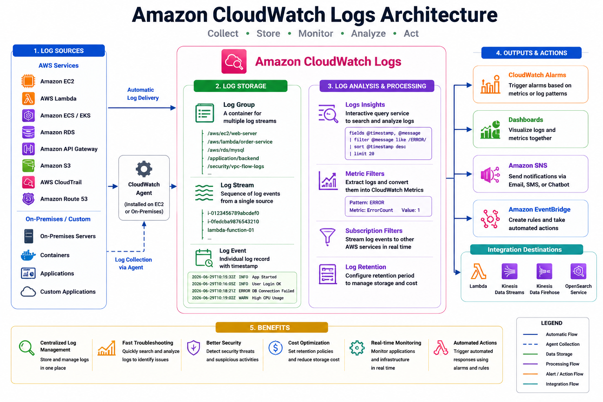

# 📜 Amazon CloudWatch Logs

## 📖 What are Amazon CloudWatch Logs?

Amazon CloudWatch Logs is a fully managed service that enables you to **collect, store, monitor, analyze, and manage log files** from AWS resources, applications, and on-premises servers.

CloudWatch Logs centralizes logs in one place, making it easier to troubleshoot issues, monitor application health, investigate security incidents, and gain operational insights.

Whether your logs come from Amazon EC2, AWS Lambda, Amazon ECS, or custom applications, CloudWatch Logs provides a scalable and secure platform for log management.

---

# 🎯 Why Do We Need CloudWatch Logs?

Logs provide detailed information about what happens inside your applications and infrastructure.

CloudWatch Logs helps you:

* Troubleshoot application errors
* Monitor server activity
* Analyze system performance
* Detect security incidents
* Investigate failures
* Centralize logs from multiple sources
* Create alerts using log data
* Meet compliance and auditing requirements

---

# 🏗️ CloudWatch Logs Architecture

<p align="center">
  
</p>

### Log Collection Workflow

```text
Application / AWS Service
            │
            ▼
      CloudWatch Agent
            │
            ▼
    CloudWatch Log Group
            │
            ▼
    CloudWatch Log Stream
            │
            ▼
  Logs Insights / Metric Filters
            │
            ▼
  CloudWatch Alarm / Dashboard
            │
            ▼
  SNS / EventBridge / Lambda
```

---

# 📦 CloudWatch Logs Components

CloudWatch Logs consists of several key components.

## 1. Log Group

A **Log Group** is a logical container for storing related log streams.

Examples:

```text
/aws/ec2/web-server
/aws/lambda/order-service
/aws/rds/mysql
/application/backend
```

Each Log Group has its own retention policy and permissions.

---

## 2. Log Stream

A **Log Stream** is a sequence of log events from a single source.

Example:

```text
Log Group
└── /aws/ec2/web-server
      ├── i-0123456789abcdef0
      ├── i-0987654321abcdef0
      └── i-0fedcba9876543210
```

Each EC2 instance writes logs to its own Log Stream.

---

## 3. Log Events

A Log Event contains:

* Timestamp
* Log message

Example:

```text
2026-06-29T10:15:32Z INFO Application Started
2026-06-29T10:16:05Z INFO User Login Successful
2026-06-29T10:18:21Z ERROR Database Connection Failed
```

---

# 📂 Log Retention

By default, logs are stored indefinitely.

You can configure retention periods such as:

* 1 Day
* 3 Days
* 7 Days
* 14 Days
* 30 Days
* 90 Days
* 180 Days
* 1 Year
* 3 Years
* 5 Years
* 10 Years
* Never Expire

Using appropriate retention policies helps reduce storage costs and meet compliance requirements.

---

# 🔍 CloudWatch Logs Insights

CloudWatch Logs Insights is an interactive query service used to search and analyze log data.

Benefits:

* Fast log searching
* Error analysis
* Performance troubleshooting
* Custom queries
* Visual results

Example query:

```sql
fields @timestamp, @message
| filter @message like /ERROR/
| sort @timestamp desc
| limit 20
```

---

# 📊 Metric Filters

Metric Filters extract numerical metrics from log data.

Example:

Application log:

```text
ERROR Database Connection Failed
```

Metric Filter:

```text
ERROR
```

CloudWatch converts matching log entries into a custom metric.

This metric can then be used to create alarms and dashboards.

---

# 🔔 Subscription Filters

Subscription Filters stream log events to other AWS services in near real time.

Supported destinations include:

* AWS Lambda
* Amazon Kinesis Data Streams
* Amazon Kinesis Data Firehose
* Amazon OpenSearch Service

Example use case:

```text
Application Logs
        │
        ▼
Subscription Filter
        │
        ▼
AWS Lambda
        │
        ▼
Send Notification
```

---

# 🖥️ Monitoring Amazon EC2 Logs

Install the CloudWatch Agent to collect:

* System logs
* Application logs
* NGINX logs
* Apache logs
* Custom log files

Common Linux log files:

```text
/var/log/messages
/var/log/syslog
/var/log/secure
/var/log/nginx/access.log
/var/log/nginx/error.log
```

---

# ⚡ Monitoring AWS Lambda Logs

AWS Lambda automatically sends logs to CloudWatch Logs.

Example Log Group:

```text
/aws/lambda/order-service
```

Typical log output:

```text
START RequestId
Processing Order...
Order Completed
END RequestId
REPORT Duration: 250 ms
```

These logs help troubleshoot Lambda functions and measure execution performance.

---

# 📈 Real-World Example

An e-commerce application runs on Amazon EC2.

Scenario:

1. Application crashes.
2. Error messages are written to `/var/log/app.log`.
3. CloudWatch Agent collects the log file.
4. Logs are stored in CloudWatch Logs.
5. A Metric Filter counts the number of `ERROR` messages.
6. A CloudWatch Alarm triggers when errors exceed a threshold.
7. Amazon SNS sends an email to the operations team.

This automated workflow reduces downtime and speeds up issue resolution.

---

# 💻 AWS CLI Examples

### Create a Log Group

```bash
aws logs create-log-group \
--log-group-name /application/backend
```

### Create a Log Stream

```bash
aws logs create-log-stream \
--log-group-name /application/backend \
--log-stream-name server-01
```

### Describe Log Groups

```bash
aws logs describe-log-groups
```

### Describe Log Streams

```bash
aws logs describe-log-streams \
--log-group-name /application/backend
```

---

# 💡 Best Practices

* Use meaningful Log Group names.
* Configure retention policies based on business requirements.
* Avoid storing logs indefinitely unless necessary.
* Use Metric Filters to detect critical events.
* Protect log data with IAM permissions.
* Encrypt sensitive logs.
* Monitor log ingestion costs.
* Archive old logs when appropriate.
* Use Logs Insights for troubleshooting.
* Organize logs by application and environment.

---

# 🛠️ Common Troubleshooting

| Problem             | Possible Cause               | Solution                             |
| ------------------- | ---------------------------- | ------------------------------------ |
| Logs not appearing  | CloudWatch Agent not running | Start the CloudWatch Agent           |
| Missing Lambda logs | IAM permissions              | Verify execution role permissions    |
| No Log Stream       | Application not writing logs | Check application configuration      |
| Delayed logs        | Network issues               | Verify connectivity and agent status |
| Logs deleted        | Retention policy expired     | Adjust retention settings            |

---

# 🎓 AWS SAA-C03 Exam Tips

* CloudWatch Logs stores log data from AWS resources and applications.
* A Log Group contains one or more Log Streams.
* A Log Stream is a sequence of log events from a single source.
* CloudWatch Logs Insights is used to search and analyze logs.
* Metric Filters create CloudWatch Metrics from log patterns.
* Subscription Filters stream logs to other AWS services.
* Lambda automatically sends logs to CloudWatch Logs.
* EC2 requires the CloudWatch Agent to send operating system and application logs.

---

# ❓ Interview Questions

1. What is Amazon CloudWatch Logs?
2. What is the difference between a Log Group and a Log Stream?
3. How does CloudWatch Logs Insights work?
4. What are Metric Filters?
5. What are Subscription Filters?
6. How do you collect logs from Amazon EC2?
7. How are Lambda logs stored?
8. How do you configure log retention?
9. How can CloudWatch Logs trigger alarms?
10. How do you troubleshoot missing logs?

---

# 📝 Key Takeaways

* CloudWatch Logs centralizes log collection and analysis.
* Log Groups organize related log streams.
* Log Streams store chronological log events from individual sources.
* Logs Insights enables powerful log searching and analysis.
* Metric Filters convert log patterns into CloudWatch Metrics.
* Subscription Filters stream logs to downstream services.
* Proper retention policies and IAM permissions improve security and reduce costs.
* CloudWatch Logs is an essential tool for monitoring, troubleshooting, and maintaining production workloads.

---

# 📚 What's Next?

In the next chapter, **05-Dashboards.md**, you will learn:

* Creating CloudWatch Dashboards
* Dashboard Widgets
* Visualizing Multiple Metrics
* Cross-Region Dashboards
* Cross-Account Monitoring
* Dashboard Sharing
* Best Practices

