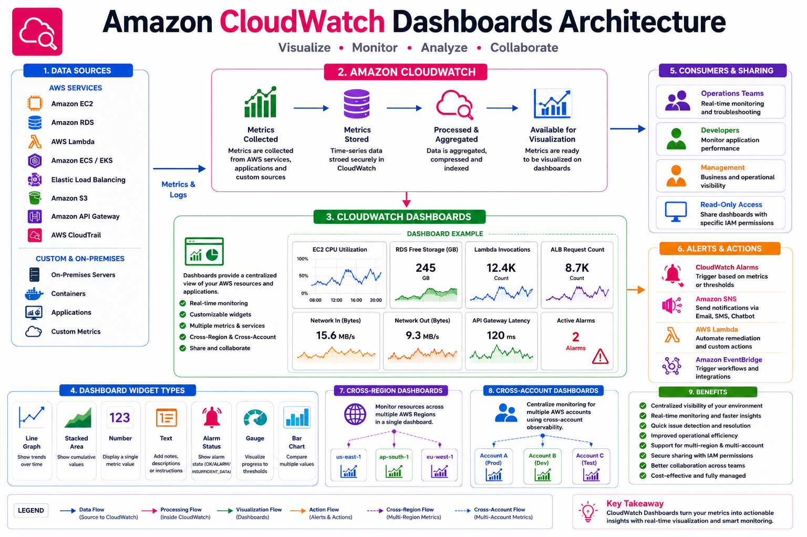

# 📊 Amazon CloudWatch Dashboards

## 📖 What are Amazon CloudWatch Dashboards?

Amazon CloudWatch Dashboards provide a centralized and customizable view of your AWS infrastructure by displaying metrics from multiple AWS services in a single place.

Dashboards help administrators, DevOps engineers, and operations teams monitor the health, performance, and availability of applications in real time.

Instead of opening multiple service consoles, you can view all important metrics from a single dashboard.

---

# 🎯 Why Use CloudWatch Dashboards?

CloudWatch Dashboards help you:

* Monitor infrastructure health in real time
* Visualize key performance metrics
* Detect issues before users are affected
* Track application performance
* Monitor multiple AWS services together
* Share dashboards with operations teams
* Reduce troubleshooting time
* Improve operational visibility

---

# 🏗️ CloudWatch Dashboard Architecture

<p align="center">
  
</p>

### Dashboard Workflow

```text
AWS Resources
      │
      ▼
CloudWatch Metrics
      │
      ▼
Dashboard Widgets
      │
      ▼
Operations Team
```

---

# 📦 Dashboard Components

A dashboard consists of one or more **widgets**.

Each widget displays a different type of information.

Examples:

* CPU Utilization
* Memory Usage
* Network Traffic
* Disk Usage
* Lambda Invocations
* Database Storage
* API Latency

---

# 📊 Widget Types

CloudWatch supports several widget types.

| Widget       | Description                      |
| ------------ | -------------------------------- |
| Line Graph   | Displays metric trends over time |
| Stacked Area | Shows cumulative values          |
| Number       | Displays a single metric value   |
| Text         | Adds documentation or notes      |
| Alarm Status | Displays current alarm state     |

---

# 📈 Example Dashboard Layout

```text
+------------------------------------------------------+
|               Production Dashboard                   |
+------------------------------------------------------+
| CPU Usage | Memory Usage | Disk Usage | Network I/O |
+------------------------------------------------------+
| Lambda Invocations | API Gateway | RDS Storage      |
+------------------------------------------------------+
| CloudWatch Alarms | Error Count | Response Time     |
+------------------------------------------------------+
```

---

# 🌍 Cross-Region Dashboards

CloudWatch Dashboards can display metrics from multiple AWS Regions.

Example:

```text
ap-south-1
us-east-1
eu-west-1
```

This is useful for global applications running in multiple Regions.

---

# 🏢 Cross-Account Dashboards

Organizations often use multiple AWS accounts for:

* Development
* Testing
* Production

CloudWatch supports **cross-account observability**, allowing a central monitoring account to display metrics from multiple AWS accounts.

Benefits:

* Centralized monitoring
* Simplified operations
* Improved visibility

---

# 🛠️ Create a Dashboard (AWS Console)

### Step 1

Open the **AWS Management Console**.

### Step 2

Navigate to:

```text
CloudWatch → Dashboards
```

### Step 3

Click **Create Dashboard**.

### Step 4

Provide a dashboard name.

Example:

```text
Production-Monitoring
```

### Step 5

Add widgets.

Examples:

* CPU Utilization
* Network In
* Network Out
* Free Storage Space
* Lambda Errors

### Step 6

Save the dashboard.

CloudWatch automatically refreshes dashboard data.

---

# 📊 Example Dashboard

A production dashboard may include:

| AWS Service               | Metric           |
| ------------------------- | ---------------- |
| Amazon EC2                | CPUUtilization   |
| Amazon EC2                | NetworkIn        |
| Amazon EC2                | NetworkOut       |
| Amazon RDS                | FreeStorageSpace |
| AWS Lambda                | Invocations      |
| AWS Lambda                | Errors           |
| API Gateway               | Latency          |
| Application Load Balancer | RequestCount     |

---

# 💻 AWS CLI Example

Create a dashboard:

```bash
aws cloudwatch put-dashboard \
--dashboard-name ProductionDashboard \
--dashboard-body file://dashboard.json
```

View dashboard:

```bash
aws cloudwatch get-dashboard \
--dashboard-name ProductionDashboard
```

Delete dashboard:

```bash
aws cloudwatch delete-dashboards \
--dashboard-names ProductionDashboard
```

---

# 📈 Real-World Example

An e-commerce company runs its application using:

* Amazon EC2
* Application Load Balancer
* Amazon RDS
* AWS Lambda

The CloudWatch Dashboard displays:

* EC2 CPU Utilization
* Memory Usage
* Network Traffic
* ALB Request Count
* Lambda Errors
* Database Storage
* Active Alarms

The operations team monitors this dashboard 24×7 to quickly identify and resolve issues.

---

# 🔐 Dashboard Permissions

Access to dashboards is controlled using IAM.

Typical permissions include:

* cloudwatch:GetDashboard
* cloudwatch:PutDashboard
* cloudwatch:DeleteDashboards
* cloudwatch:ListDashboards

Apply the principle of least privilege when granting access.

---

# 💡 Best Practices

* Create separate dashboards for Dev, Test, and Production.
* Display only important metrics.
* Group related metrics together.
* Use meaningful widget titles.
* Include alarm status widgets.
* Review dashboards regularly.
* Share dashboards with relevant teams.
* Avoid overcrowding a single dashboard.

---

# 🌟 Benefits

* Centralized monitoring
* Real-time visibility
* Faster troubleshooting
* Improved collaboration
* Better decision-making
* Reduced downtime
* Supports cross-region monitoring
* Supports cross-account monitoring

---

# 🎓 AWS SAA-C03 Exam Tips

* Dashboards display CloudWatch Metrics visually.
* Dashboards can include metrics from multiple AWS services.
* Dashboards support cross-region monitoring.
* Dashboard widgets include graphs, numbers, text, and alarm status.
* Dashboards do not collect metrics—they only display existing metrics.

---

# ❓ Interview Questions

### 1. What is a CloudWatch Dashboard?

### 2. Why are dashboards useful?

### 3. What types of widgets are supported?

### 4. Can dashboards display metrics from multiple AWS Regions?

### 5. What is cross-account observability?

### 6. How do dashboards help operations teams?

### 7. Which IAM permissions are required to manage dashboards?

### 8. Can CloudWatch Dashboards display alarm status?

### 9. Can a dashboard contain metrics from multiple AWS services?

### 10. What are some dashboard design best practices?

---

# 📝 Key Takeaways

* CloudWatch Dashboards provide a centralized view of infrastructure health.
* Dashboards display metrics collected by CloudWatch.
* Widgets allow visualization of metrics, alarms, and text.
* Cross-region and cross-account dashboards simplify monitoring large environments.
* Well-designed dashboards improve operational efficiency and reduce incident response time.

---

# 📚 What's Next?

In the next chapter, **06-Alarms.md**, you will learn:

* CloudWatch Alarms
* Alarm States (OK, ALARM, INSUFFICIENT_DATA)
* Static and Dynamic Thresholds
* SNS Notifications
* EC2 Auto Recovery
* Auto Scaling Integration
* Composite Alarms
* Real-World Monitoring Scenarios

