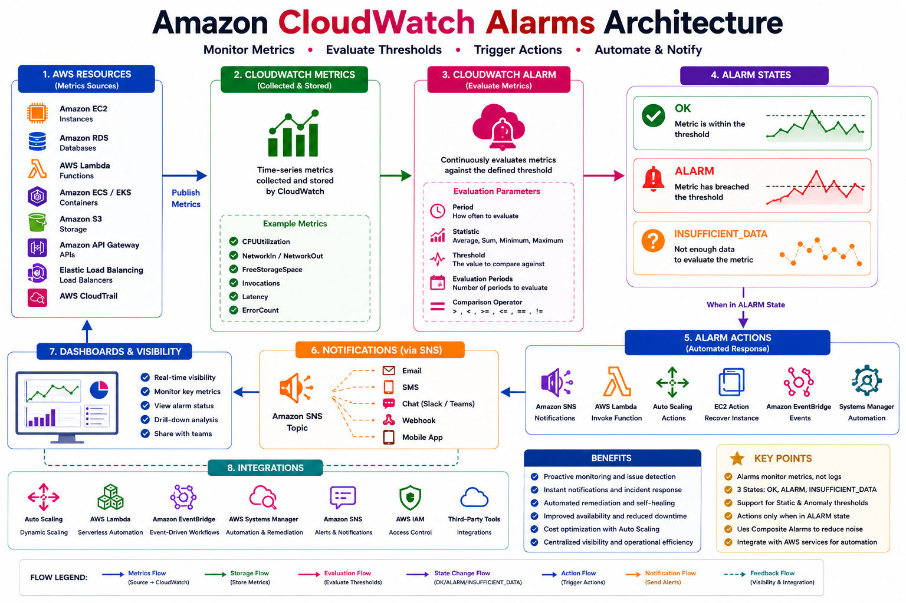

# 🚨 Amazon CloudWatch Alarms

## 📖 What are Amazon CloudWatch Alarms?

Amazon CloudWatch Alarms continuously monitor CloudWatch metrics and automatically perform actions when predefined thresholds are reached.

An alarm evaluates metric data over a specified period and changes its state based on the evaluation result. This enables proactive monitoring, automated responses, and timely notifications when system performance deviates from expected behavior.

CloudWatch Alarms help organizations detect issues before they impact users, improving application reliability and operational efficiency.

---

# 🎯 Why Use CloudWatch Alarms?

CloudWatch Alarms allow you to:

* Monitor infrastructure health
* Detect performance issues
* Receive instant notifications
* Trigger automated remediation
* Reduce application downtime
* Improve operational visibility
* Support Auto Scaling
* Monitor production environments 24×7

---

# 🏗️ CloudWatch Alarm Architecture

<p align="center">
  
</p>

### Alarm Workflow

```text
AWS Resource
      │
      ▼
CloudWatch Metrics
      │
      ▼
CloudWatch Alarm
      │
      ▼
Evaluate Threshold
      │
 ┌────┴─────┐
 │          │
 ▼          ▼
OK       ALARM
             │
             ▼
SNS / Lambda / Auto Scaling / EventBridge
```

---

# 📊 Alarm States

A CloudWatch Alarm can exist in one of three states.

| Alarm State         | Description                                         |
| ------------------- | --------------------------------------------------- |
| ✅ OK                | Metric is within the configured threshold           |
| 🚨 ALARM            | Metric exceeds the configured threshold             |
| ❓ INSUFFICIENT_DATA | Not enough data is available to evaluate the metric |

Example:

```text
CPU Utilization

0% ─────────────────────────────

Threshold = 80%

65%  → OK

82%  → ALARM

No Data → INSUFFICIENT_DATA
```

---

# 📈 How CloudWatch Alarms Work

The alarm evaluation process follows these steps:

1. AWS resources publish metrics.
2. CloudWatch stores the metrics.
3. The alarm periodically evaluates the metric.
4. If the threshold is exceeded, the alarm changes to the **ALARM** state.
5. CloudWatch performs the configured action.
6. When the metric returns to normal, the alarm changes back to the **OK** state.

---

# 📦 Alarm Types

## 1. Metric Alarm

Monitors a single CloudWatch metric.

Example:

* CPU Utilization
* Memory Usage
* Disk Space
* Network Traffic

---

## 2. Composite Alarm

A Composite Alarm combines multiple alarms into a single alarm using logical conditions.

Example:

```text
CPU Alarm
      AND
Memory Alarm
      │
      ▼
Composite Alarm
```

Benefits:

* Reduces alert fatigue
* Simplifies monitoring
* Improves operational visibility

---

# ⚙️ Threshold Types

CloudWatch supports two threshold types.

## Static Threshold

A fixed value defined by the administrator.

Example:

```text
CPU Utilization > 80%
```

---

## Dynamic Threshold (Anomaly Detection)

CloudWatch automatically learns normal behavior and detects unusual patterns.

Benefits:

* Reduces false alarms
* Adapts to workload changes
* Ideal for variable traffic patterns

---

# 🔔 Alarm Actions

When an alarm enters the **ALARM** state, CloudWatch can perform one or more actions.

Supported actions include:

* Send an Amazon SNS notification
* Invoke an AWS Lambda function
* Trigger an Auto Scaling policy
* Recover an EC2 instance
* Create an EventBridge event
* Start an AWS Systems Manager Automation runbook

---

# 📧 Amazon SNS Integration

CloudWatch Alarms commonly use Amazon SNS to notify administrators.

Example workflow:

```text
CloudWatch Alarm
        │
        ▼
Amazon SNS
        │
 ┌──────┼──────┐
 ▼      ▼      ▼
Email   SMS   Chat Application
```

This ensures operations teams receive alerts immediately.

---

# 🚀 Auto Scaling Integration

CloudWatch Alarms can automatically scale EC2 instances based on resource utilization.

Example:

```text
CPU Utilization > 80%

↓

CloudWatch Alarm

↓

Auto Scaling Policy

↓

Launch Additional EC2 Instance
```

This improves application availability during traffic spikes.

---

# 🛠️ Create an Alarm (AWS Console)

### Step 1

Open the **AWS Management Console**.

### Step 2

Navigate to:

```text
CloudWatch → Alarms
```

### Step 3

Click **Create Alarm**.

### Step 4

Choose a metric.

Example:

```text
AWS/EC2 → CPUUtilization
```

### Step 5

Configure:

* Threshold
* Evaluation Period
* Statistic
* Comparison Operator

### Step 6

Select an action.

Example:

* Send notification to Amazon SNS

### Step 7

Provide an alarm name.

Example:

```text
EC2-HighCPU-Alarm
```

### Step 8

Review and create the alarm.

---

# 💻 AWS CLI Example

Create an EC2 CPU alarm:

```bash
aws cloudwatch put-metric-alarm \
--alarm-name EC2-HighCPU \
--metric-name CPUUtilization \
--namespace AWS/EC2 \
--statistic Average \
--period 300 \
--threshold 80 \
--comparison-operator GreaterThanThreshold \
--evaluation-periods 2 \
--alarm-actions arn:aws:sns:region:account-id:MyTopic
```

List alarms:

```bash
aws cloudwatch describe-alarms
```

Delete an alarm:

```bash
aws cloudwatch delete-alarms \
--alarm-names EC2-HighCPU
```

---

# 🌍 Real-World Example

A production web application runs on an Auto Scaling group of Amazon EC2 instances.

Monitoring strategy:

* Alarm when CPU utilization exceeds 80%
* Notify the operations team using Amazon SNS
* Trigger Auto Scaling to launch additional instances
* Create an EventBridge event for automation
* Return to the **OK** state once CPU utilization drops below the threshold

This approach minimizes downtime and maintains application performance during periods of high demand.

---

# 💡 Best Practices

* Create alarms only for critical metrics.
* Avoid excessive alarm notifications.
* Use descriptive alarm names.
* Configure meaningful thresholds.
* Test alarm actions regularly.
* Use Composite Alarms to reduce alert noise.
* Implement anomaly detection for dynamic workloads.
* Review and update alarms periodically.

---

# 🛠️ Common Troubleshooting

| Problem                          | Possible Cause                      | Solution                       |
| -------------------------------- | ----------------------------------- | ------------------------------ |
| Alarm not triggering             | Threshold too high                  | Review threshold configuration |
| Alarm stuck in INSUFFICIENT_DATA | Metric not published                | Verify metric availability     |
| No SNS notification              | Incorrect SNS topic or subscription | Check SNS configuration        |
| False alarms                     | Evaluation period too short         | Increase evaluation periods    |
| Auto Scaling not triggered       | Policy not attached                 | Verify Auto Scaling policy     |

---

# 🎓 AWS SAA-C03 Exam Tips

* CloudWatch Alarms monitor metrics, not logs.
* Every alarm has three possible states: OK, ALARM, and INSUFFICIENT_DATA.
* Metric Alarms monitor a single metric.
* Composite Alarms combine multiple alarms.
* Amazon SNS is commonly used for notifications.
* CloudWatch Alarms integrate with Auto Scaling, Lambda, and EventBridge.
* Anomaly Detection uses machine learning to identify unusual metric behavior.

---

# ❓ Interview Questions

1. What is a CloudWatch Alarm?
2. What are the three alarm states?
3. What is the difference between Metric Alarms and Composite Alarms?
4. How does anomaly detection work?
5. How do CloudWatch Alarms integrate with Auto Scaling?
6. Can CloudWatch Alarms invoke AWS Lambda?
7. How are SNS notifications configured?
8. Why is INSUFFICIENT_DATA important?
9. How do evaluation periods affect alarm behavior?
10. What are CloudWatch Alarm best practices?

---

# 📝 Key Takeaways

* CloudWatch Alarms continuously evaluate metrics against defined thresholds.
* Alarms improve reliability by detecting issues early.
* Alarm states include OK, ALARM, and INSUFFICIENT_DATA.
* Amazon SNS provides real-time notifications.
* Auto Scaling, Lambda, and EventBridge enable automated remediation.
* Properly configured alarms reduce downtime and improve operational efficiency.

---

# 📚 What's Next?

In the next chapter, **07-Events-and-EventBridge.md**, you will learn:

* CloudWatch Events
* Amazon EventBridge
* Event Bus
* Event Patterns
* Scheduled Rules
* Cron Expressions
* Rate Expressions
* Event-Driven Automation
* Lambda Integration
* Real-World Automation Scenarios

