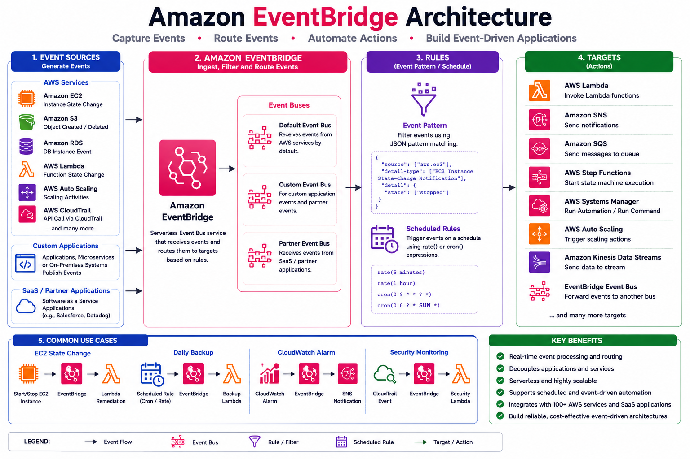

# ⚡ Amazon CloudWatch Events and Amazon EventBridge

## 📖 Introduction

Modern cloud applications generate thousands of events every second. These events can represent changes in resource states, application activities, scheduled tasks, or security events.

Amazon EventBridge is AWS's fully managed event bus service that enables event-driven architectures by routing events from AWS services, custom applications, and SaaS applications to multiple targets.

Originally known as **CloudWatch Events**, the service evolved into **Amazon EventBridge**, providing more powerful event routing, filtering, integration, and automation capabilities.

---

# 🎯 Why Use EventBridge?

Amazon EventBridge helps organizations:

* Automate repetitive operational tasks
* Respond to infrastructure changes automatically
* Trigger serverless workflows
* Schedule jobs
* Build event-driven applications
* Reduce manual intervention
* Improve operational efficiency
* Integrate AWS services with external SaaS platforms

---

# 🏗️ EventBridge Architecture

<p align="center">
  
</p>

### Event Processing Workflow

```text id="2zvt2u"
AWS Services
Applications
SaaS Platforms
       │
       ▼
Amazon EventBridge
       │
       ▼
Event Rule
       │
       ▼
Target Service
       │
       ▼
Automation
```

---

# 📦 Core Components

## 1. Event Source

An Event Source generates events.

Examples include:

* Amazon EC2
* Amazon S3
* AWS Lambda
* Amazon RDS
* AWS CloudTrail
* AWS Auto Scaling
* AWS CodePipeline
* Custom Applications
* Third-party SaaS Applications

Example:

```text id="dy0ye7"
EC2 Instance State Changed
```

---

## 2. Event Bus

An Event Bus receives and routes events.

EventBridge supports:

* Default Event Bus
* Custom Event Bus
* Partner Event Bus

### Default Event Bus

Receives events from AWS services automatically.

### Custom Event Bus

Used for custom applications.

### Partner Event Bus

Receives events from integrated SaaS applications.

---

## 3. Event Rule

Rules determine which events should be processed.

A rule contains:

* Event Pattern
* Schedule
* Target

Example:

```text id="y1ecza"
Source = aws.ec2

State = stopped
```

When the event matches, EventBridge triggers the configured target.

---

## 4. Target

Targets receive events from EventBridge.

Supported targets include:

* AWS Lambda
* Amazon SNS
* Amazon SQS
* AWS Step Functions
* AWS Systems Manager
* Amazon ECS
* AWS Batch
* Amazon Kinesis
* AWS CodeBuild
* Event Bus

One rule can invoke multiple targets.

---

# 🔄 Event-Driven Workflow

```text id="5djowd"
EC2 Instance Stops

↓

Event Generated

↓

Amazon EventBridge

↓

Event Rule Matches

↓

AWS Lambda

↓

Restart Instance

↓

Administrator Notified
```

---

# 📅 Scheduled Rules

EventBridge can trigger tasks on a schedule without requiring external schedulers.

Two scheduling methods are supported:

## Rate Expressions

Runs at fixed intervals.

Examples:

```text id="g6s2ib"
rate(5 minutes)

rate(1 hour)

rate(1 day)
```

---

## Cron Expressions

Runs at specific dates and times.

Example:

```text id="r7pqgn"
cron(0 9 * * ? *)
```

Runs every day at **09:00 UTC**.

Common use cases:

* Daily backups
* Weekly reports
* Monthly cleanup
* Scheduled Lambda execution

---

# 🎯 Event Patterns

Event Patterns filter events before routing them to targets.

Example:

```json id="lbbpk6"
{
  "source": ["aws.ec2"],
  "detail-type": ["EC2 Instance State-change Notification"],
  "detail": {
    "state": ["stopped"]
  }
}
```

Only matching events trigger the configured target.

---

# 🚀 Common Automation Examples

## Example 1: EC2 State Change

Workflow:

```text id="qvqu6g"
EC2 Instance Stopped

↓

EventBridge

↓

Lambda

↓

Start EC2 Instance
```

---

## Example 2: Daily Backup

```text id="fwmsfa"
Cron Schedule

↓

EventBridge

↓

Lambda

↓

Create EBS Snapshot
```

---

## Example 3: CloudWatch Alarm

```text id="u26g2l"
CloudWatch Alarm

↓

EventBridge

↓

SNS

↓

Email Notification
```

---

## Example 4: Security Monitoring

```text id="r8xng2"
CloudTrail Event

↓

EventBridge

↓

Lambda

↓

Security Validation
```

---

# 💻 AWS CLI Example

Create a scheduled rule:

```bash id="ckm1ps"
aws events put-rule \
--name DailyBackup \
--schedule-expression "rate(1 day)"
```

List rules:

```bash id="4nbv5t"
aws events list-rules
```

Delete a rule:

```bash id="pr6rhn"
aws events delete-rule \
--name DailyBackup
```

---

# 🌍 Real-World Example

An online shopping application requires automated infrastructure management.

Scenario:

1. CPU utilization exceeds 80%.
2. CloudWatch Alarm changes to the **ALARM** state.
3. EventBridge receives the event.
4. A rule matches the alarm event.
5. AWS Lambda executes a remediation function.
6. Auto Scaling launches a new EC2 instance.
7. Amazon SNS notifies the operations team.

This workflow enables self-healing infrastructure with minimal manual intervention.

---

# 🔐 Security Best Practices

* Apply least-privilege IAM permissions.
* Use separate Event Buses for different applications.
* Validate event sources.
* Encrypt sensitive event data.
* Monitor failed event deliveries.
* Log EventBridge activity using CloudTrail.
* Restrict access to event rules.

---

# 💡 Best Practices

* Use meaningful rule names.
* Filter only the required events.
* Avoid duplicate rules.
* Monitor failed invocations.
* Use dead-letter queues (DLQs) for critical workloads.
* Test rules before production deployment.
* Separate production and development event buses.
* Document event workflows.

---

# 🛠️ Common Troubleshooting

| Problem                    | Possible Cause                 | Solution                      |
| -------------------------- | ------------------------------ | ----------------------------- |
| Rule not triggering        | Event pattern mismatch         | Verify the event pattern      |
| Target not invoked         | Missing IAM permissions        | Check target IAM role         |
| Scheduled rule not running | Invalid cron expression        | Validate schedule syntax      |
| Duplicate events           | Multiple matching rules        | Review rule configuration     |
| Lambda not executing       | Incorrect function permissions | Verify Lambda resource policy |

---

# 📊 CloudWatch Events vs Amazon EventBridge

| Feature                  | CloudWatch Events | Amazon EventBridge |
| ------------------------ | ----------------- | ------------------ |
| AWS Service Events       | ✅ Yes             | ✅ Yes              |
| Scheduled Rules          | ✅ Yes             | ✅ Yes              |
| Custom Event Bus         | ❌ No              | ✅ Yes              |
| SaaS Integrations        | ❌ No              | ✅ Yes              |
| Advanced Event Filtering | Basic             | Advanced           |
| Event Replay             | ❌ No              | ✅ Yes              |
| Schema Registry          | ❌ No              | ✅ Yes              |

---

# 🎓 AWS SAA-C03 Exam Tips

* Amazon EventBridge is the successor to CloudWatch Events.
* EventBridge routes events from AWS services, custom applications, and SaaS platforms.
* Rules consist of an event pattern or schedule and one or more targets.
* EventBridge supports multiple targets for a single event.
* Scheduled rules use either `rate()` or `cron()` expressions.
* EventBridge integrates with CloudWatch Alarms for event-driven automation.

---

# ❓ Interview Questions

1. What is Amazon EventBridge?
2. What is the difference between CloudWatch Events and EventBridge?
3. What are the different types of Event Buses?
4. What is an Event Pattern?
5. What is the difference between `rate()` and `cron()` expressions?
6. Can one EventBridge rule trigger multiple targets?
7. Which AWS services commonly integrate with EventBridge?
8. How do you automate EC2 management using EventBridge?
9. What is the purpose of a Dead-Letter Queue (DLQ)?
10. What are EventBridge best practices?

---

# 📝 Key Takeaways

* Amazon EventBridge is AWS's central event routing service.
* It enables event-driven architectures and automation.
* Events can originate from AWS services, applications, and SaaS platforms.
* Rules filter events and send them to one or more targets.
* Scheduled rules support automation without external schedulers.
* EventBridge integrates seamlessly with CloudWatch, Lambda, SNS, Auto Scaling, and many other AWS services.

---

# 📚 What's Next?

In the next chapter, **08-Best-Practices.md**, you will learn:

* Monitoring Strategy
* Naming Conventions
* Alarm Design
* Log Retention
* Security Best Practices
* Cost Optimization
* Cross-Account Monitoring
* Production Recommendations

