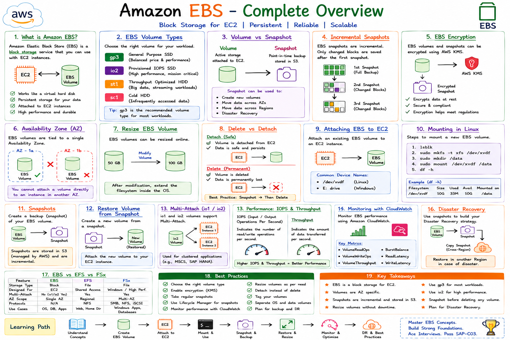
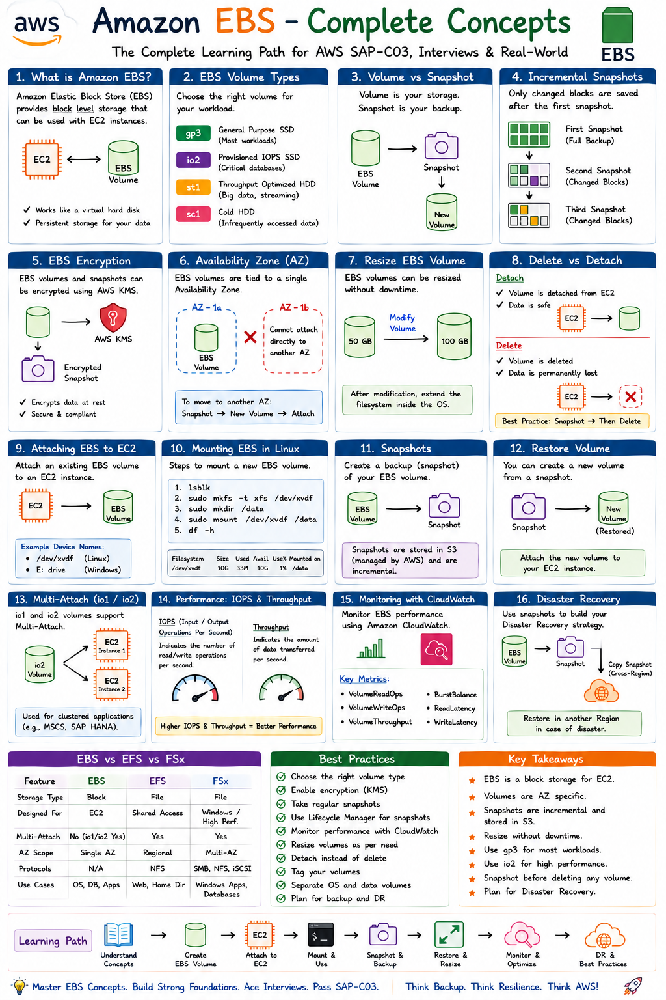

# 📦 AWS-NotesEBS

<p align="center">
  
</p>


<p align="center">
  
</p>


<h1 align="center">📦 Amazon Elastic Block Store (EBS) - Complete Guide</h1>

<p align="center">
A complete hands-on guide to mastering <b>Amazon Elastic Block Store (EBS)</b> with detailed notes, architecture diagrams, practical labs, interview questions, and best practices.
</p>

<p align="center">


</p>

---

# 📖 About This Repository

This repository is designed for beginners, cloud engineers, system administrators, and DevOps professionals who want to gain practical knowledge of **Amazon EBS (Elastic Block Store)**.

The content starts with the basics and gradually progresses to advanced topics, making it suitable for both learning and interview preparation.

---

# 🎯 Learning Objectives

After completing this repository, you will be able to:

* ✅ Understand Amazon EBS fundamentals
* ✅ Create and manage EBS volumes
* ✅ Attach volumes to EC2 instances
* ✅ Mount EBS volumes on Linux
* ✅ Resize EBS volumes
* ✅ Extend Linux file systems
* ✅ Create and restore snapshots
* ✅ Configure EBS encryption
* ✅ Understand Delete vs Detach
* ✅ Apply AWS best practices
* ✅ Prepare for AWS certification interviews

---

# 📂 Repository Structure

```text
AWS-NotesEBS/
│
├── README.md
│
├── docs/
│   ├── 01-Introduction.md
│   ├── 02-What-is-EBS.md
│   ├── 03-EBS-Volume-Types.md
│   ├── 04-Create-and-Attach-EBS.md
│   ├── 05-Mount-EBS-on-Linux.md
│   ├── 06-Resize-EBS-Volume.md
│   ├── 07-EBS-Snapshots.md
│   ├── 08-Encryption.md
│   ├── 09-Delete-vs-Detach.md
│   ├── 10-Best-Practices.md
│   ├── 11-Interview-Questions.md
│   └── 12-Hands-On-Lab.md
│
└── assets/
    ├── ebs-overview.png
    ├── ebs-volume-types.png
    ├── ebs-attach-flow.png
    ├── snapshot-flow.png
    └── resize-flow.png
```

---

# 📚 Topics Covered

| No. | Topic                      | Status |
| --- | -------------------------- | ------ |
| 01  | Introduction               | ✅      |
| 02  | What is Amazon EBS         | ✅      |
| 03  | EBS Volume Types           | ✅      |
| 04  | Create & Attach EBS Volume | ✅      |
| 05  | Mount EBS on Linux         | ✅      |
| 06  | Resize EBS Volume          | ✅      |
| 07  | EBS Snapshots              | ✅      |
| 08  | EBS Encryption             | ✅      |
| 09  | Delete vs Detach           | ✅      |
| 10  | Best Practices             | ✅      |
| 11  | Interview Questions        | ✅      |
| 12  | Hands-on Lab               | ✅      |

---

# 💻 Hands-on Labs

This repository includes practical demonstrations for:

* Creating EBS volumes
* Attaching volumes to EC2
* Linux partitioning
* Formatting file systems
* Mounting storage
* Persistent mounting using `/etc/fstab`
* Resizing storage
* Expanding file systems
* Creating snapshots
* Restoring snapshots
* Encrypting EBS volumes

---

# 🎨 Architecture Diagrams

The repository contains professional diagrams explaining:

* Amazon EBS Architecture
* EC2 and EBS Relationship
* EBS Volume Types
* Snapshot Workflow
* Volume Resize Process
* Encryption Workflow

---

# 🎯 Who Should Use This Repository?

* AWS Beginners
* Linux Administrators
* DevOps Engineers
* Cloud Engineers
* AWS Certification Aspirants
* Students
* IT Professionals

---

# 🚀 Prerequisites

Before starting this guide, you should have:

* AWS Account
* Basic Linux Knowledge
* Amazon EC2 Instance
* SSH Access
* Git & GitHub Basics

---

# 🤝 Contributing

Contributions, suggestions, and improvements are welcome.

If you find this repository helpful, consider giving it a ⭐ on GitHub.

---

# 📄 License

This project is licensed under the **MIT License**.

---

# 👨‍💻 Author

**Newton Babu Nandru**

Senior Linux & Production Support Engineer | AWS Cloud & DevOps Engineer


Happy Learning! 🚀

