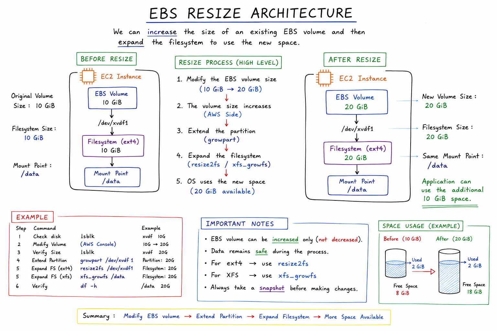
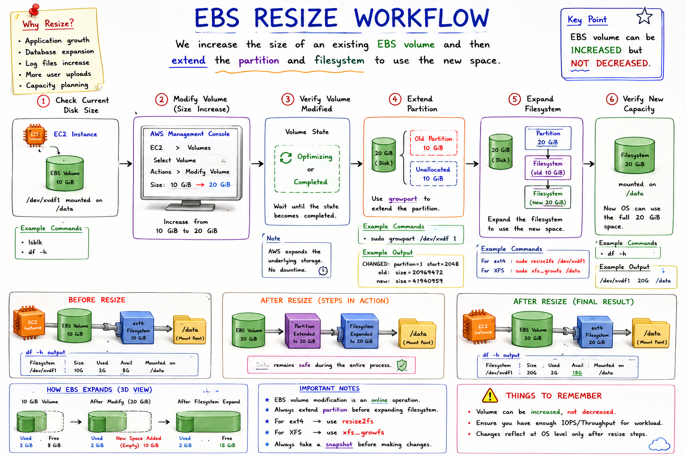

# 📀 06 - Resize an Amazon EBS Volume

## 📖 Introduction

As applications grow, storage requirements increase. Amazon EBS allows you to increase the size of an existing volume without creating a new volume or migrating data.

This feature helps administrators scale storage with minimal downtime and operational effort.

---

## 🎯 Learning Objectives

By the end of this lab, you will be able to:

- Modify an EBS volume size
- Verify the updated volume size
- Extend the partition (if required)
- Expand the filesystem
- Confirm the new storage capacity

---

## 🏗️ Architecture



### Resize Workflow

```text
Original Volume (10 GiB)
          │
          ▼
Modify Volume
          │
          ▼
Volume Size Increased (20 GiB)
          │
          ▼
Extend Filesystem
          │
          ▼
Operating System Uses New Space
```

---

# Why Resize an EBS Volume?

Common reasons include:

- Application storage growth
- Database expansion
- Log file accumulation
- Increased user uploads
- Capacity planning

Example:

```text
Before Resize

/data
 └── 10 GiB

After Resize

/data
 └── 20 GiB
```

---

# Step 1: Check Current Disk Size

Connect to your EC2 instance:

```bash
ssh -i mykey.pem ec2-user@PUBLIC-IP
```

View block devices:

```bash
lsblk
```

Example:

```text
NAME    SIZE TYPE MOUNTPOINT
xvda      8G disk
└─xvda1   8G part /

xvdf     10G disk
└─xvdf1  10G part /data
```

Check filesystem usage:

```bash
df -h
```

Example:

```text
Filesystem      Size Used Avail Mounted on
/dev/xvdf1      10G  2G   8G    /data
```

---

# Step 2: Modify the EBS Volume

Navigate to:

```text
AWS Console
    ↓
EC2
    ↓
Volumes
    ↓
Select Volume
    ↓
Actions
    ↓
Modify Volume
```

Current Size:

```text
10 GiB
```

New Size:

```text
20 GiB
```

Click:

```text
Modify
```

Confirm the change.

---

# Step 3: Verify Volume Modification

Wait until the volume state shows:

```text
Optimizing
```

or

```text
Completed
```

AWS expands the underlying block storage without affecting existing data.

---

# Step 4: Verify New Disk Size in Linux

Check disk information:

```bash
lsblk
```

Example:

```text
NAME    SIZE TYPE MOUNTPOINT
xvdf     20G disk
└─xvdf1  10G part /data
```

Notice:

```text
Disk = 20G
Partition = 10G
```

The operating system sees the larger disk, but the partition and filesystem still use the old size.

---

# Step 5: Grow the Partition

For Amazon Linux 2 and modern Linux distributions:

Install growpart if needed:

```bash
sudo yum install -y cloud-utils-growpart
```

Extend the partition:

```bash
sudo growpart /dev/xvdf 1
```

Example Output:

```text
CHANGED: partition=1 start=2048 old: size=20969472 new: size=41940959
```

Verify:

```bash
lsblk
```

Example:

```text
NAME    SIZE TYPE MOUNTPOINT
xvdf     20G disk
└─xvdf1  20G part /data
```

---

# Step 6: Expand the Filesystem

## For ext4 Filesystem

Check filesystem type:

```bash
df -Th
```

Resize:

```bash
sudo resize2fs /dev/xvdf1
```

Example Output:

```text
Filesystem resized successfully
```

---

## For XFS Filesystem

Most Amazon Linux systems use XFS.

Resize:

```bash
sudo xfs_growfs /data
```

Example Output:

```text
data blocks changed
```

---

# Step 7: Verify New Capacity

Check storage:

```bash
df -h
```

Example:

```text
Filesystem      Size Used Avail Mounted on
/dev/xvdf1      20G  2G   18G   /data
```

Success ✅

The filesystem now uses the full resized volume.

---

# Visual Workflow



```text
10 GiB Volume
      │
      ▼
Modify Volume
      │
      ▼
20 GiB Volume
      │
      ▼
growpart
      │
      ▼
resize2fs / xfs_growfs
      │
      ▼
20 GiB Available
```

---

# Important Notes

### EBS Volumes Can Be Increased

```text
10 GiB → 20 GiB
20 GiB → 50 GiB
50 GiB → 100 GiB
```

Supported ✅

---

### EBS Volumes Cannot Be Reduced

```text
100 GiB → 50 GiB
```

Not Supported ❌

To reduce size:

1. Create Snapshot
2. Create New Smaller Volume
3. Restore Data

---

### Data Remains Safe

AWS performs online volume modification.

Existing files remain intact during resizing.

---

# Troubleshooting

## Filesystem Size Did Not Change

Check:

```bash
lsblk
```

Then run:

```bash
resize2fs
```

or

```bash
xfs_growfs
```

---

## Partition Still Shows Old Size

Run:

```bash
growpart
```

before resizing the filesystem.

---

## Wrong Filesystem Command

Check filesystem type:

```bash
df -Th
```

Use:

```text
ext4 → resize2fs
xfs  → xfs_growfs
```

---

# Interview Questions

### Can you resize an EBS volume without stopping EC2?

**Answer:** Yes. AWS supports online EBS volume modification.

---

### Can an EBS volume be reduced in size?

**Answer:** No. EBS volumes can only be increased.

---

### Which command extends an ext4 filesystem?

```bash
resize2fs
```

---

### Which command extends an XFS filesystem?

```bash
xfs_growfs
```

---

### How do you verify the new size?

```bash
df -h
```

and

```bash
lsblk
```

---

# 📚 Summary

- Amazon EBS supports online volume resizing.
- Modify the volume size from the AWS Console.
- Use `growpart` to expand the partition.
- Use `resize2fs` for ext4 filesystems.
- Use `xfs_growfs` for XFS filesystems.
- Verify the new size using `df -h`.
- EBS volumes can be increased but not decreased.

➡️ Next Chapter: **07-EBS-Snapshots.md**
