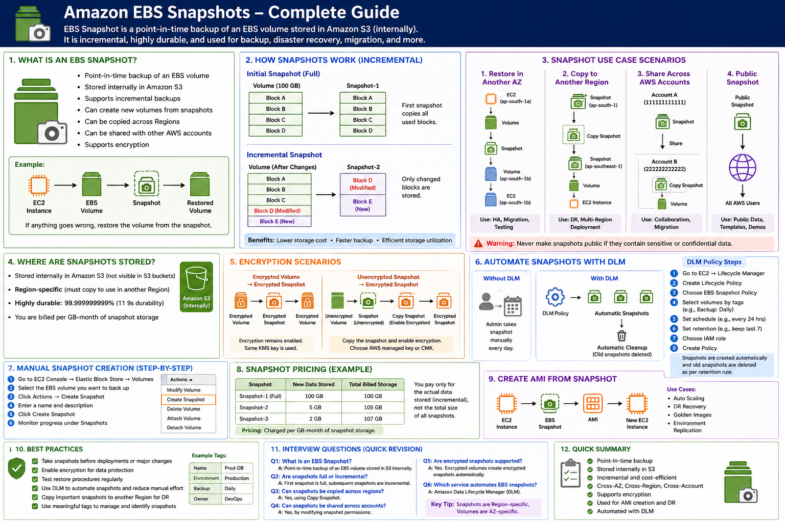

# Amazon EBS Snapshots – Complete Guide

<p align="center">
  
</p>

## Overview

Amazon EBS Snapshot is a point-in-time backup of an EBS volume stored internally in Amazon S3. It supports incremental backups, encryption, cross-region copy, cross-account sharing, and disaster recovery.

---
## What is an Amazon EBS Snapshot?

An **Amazon EBS Snapshot** is a **point-in-time backup** of an Amazon EBS volume.

Think of it like taking a photograph of your EBS volume at a specific moment. If your volume gets corrupted, deleted, or modified accidentally, you can restore it from the snapshot.

### Key Features

* Point-in-time backup
* Stored in Amazon S3 (AWS managed)
* Incremental backups
* Can create new volumes from snapshots
* Can be copied across Regions
* Can be shared with other AWS accounts
* Supports encryption

---

## Real-Life Example

Suppose you have:

* EC2 Instance: Web Server
* EBS Volume: 100 GB
* Data Stored: Application files and database

Before making application changes, you take a snapshot.

If the deployment fails:

```text
Snapshot
   ↓
Restore Volume
   ↓
Attach to EC2
```

You can recover the system quickly.

---

# How EBS Snapshots Work

## Initial Snapshot

When you create the first snapshot:

```text
Volume (100 GB)
├── Block A
├── Block B
├── Block C
└── Block D

Snapshot-1
├── Block A
├── Block B
├── Block C
└── Block D
```

AWS copies all used blocks.

---

## Incremental Snapshot

After changing Block D and adding Block E:

```text
Volume
├── Block A
├── Block B
├── Block C
├── Block D (Modified)
└── Block E (New)

Snapshot-2
├── Block D
└── Block E
```

Only changed blocks are stored.

### Benefits

* Lower storage cost
* Faster backup creation
* Efficient storage utilization

---

# Where Are Snapshots Stored?

Snapshots are stored internally in Amazon S3.

### Important Points

* Not visible in your S3 buckets
* Cannot download directly from S3
* AWS manages storage automatically

### Durability

```text
99.999999999%
(11 Nines Durability)
```

Meaning snapshots are extremely reliable.

---

# Manual Snapshot Creation

## Step 1

Navigate to:

```text
AWS Console
   ↓
EC2
   ↓
Elastic Block Store
   ↓
Volumes
```

## Step 2

Select the EBS Volume.

Example:

```text
vol-1234567890abcdef
```

## Step 3

Click:

```text
Actions
   ↓
Create Snapshot
```

## Step 4

Provide Details

```yaml
Name: Production-Backup

Description: Backup before application upgrade
```

## Step 5

Click **Create Snapshot**

## Step 6

Monitor Progress

```text
EC2
 ↓
Snapshots
```

Status:

```text
Pending
Completed
Error
```

---

# Snapshot Restore Process

```text
Snapshot
    ↓
Create Volume
    ↓
Attach Volume
    ↓
EC2 Instance
```

Example:

```text
Snapshot : snap-12345
Volume   : vol-67890
Instance : i-12345
```

The restored volume contains the same data as when the snapshot was taken.

---

# Scenario 1: Restore Snapshot to Another Availability Zone

### Source

```text
Region : Mumbai
AZ     : ap-south-1a
```

### Restore To

```text
AZ : ap-south-1b
```

### Architecture

```text
EC2 (1a)
   │
   ▼
Volume
   │
   ▼
Snapshot
   │
   ▼
Create Volume
   │
   ▼
AZ: ap-south-1b
   │
   ▼
Attach to EC2
```

### Use Cases

* High Availability
* Migration
* Testing Environment

---

# Scenario 2: Copy Snapshot to Another Region

### Source Region

```text
Mumbai (ap-south-1)
```

### Destination Region

```text
Singapore (ap-southeast-1)
```

### Architecture

```text
Mumbai Region
      │
      ▼
 Snapshot
      │
      ▼
Copy Snapshot
      │
      ▼
Singapore Region
      │
      ▼
Create Volume
      │
      ▼
Launch EC2
```

### Use Cases

* Disaster Recovery
* Business Continuity
* Multi-Region Deployments

### AWS CLI Example

```bash
aws ec2 copy-snapshot \
--source-region ap-south-1 \
--source-snapshot-id snap-123456 \
--region ap-southeast-1 \
--description "DR Backup"
```

---

# Scenario 3: Share Snapshot Across AWS Accounts

### Account A

```text
111111111111
```

### Account B

```text
222222222222
```

### Architecture

```text
Account A
    │
    ▼
 Snapshot
    │
Share
    │
    ▼
Account B
    │
Copy Snapshot
    │
Create Volume
```

### Steps

1. Select Snapshot
2. Actions
3. Modify Permissions
4. Enter AWS Account ID
5. Save

### Use Cases

* Account Migration
* Team Collaboration
* Cross-Account Data Sharing

---

# Scenario 4: Public Snapshot Sharing

### Architecture

```text
Your Snapshot
      │
Make Public
      │
      ▼
All AWS Users
```

### Use Cases

* Public datasets
* Demo environments
* Learning resources

### Warning

Never make snapshots public if they contain:

* Passwords
* Customer Data
* Private Keys
* Databases
* Confidential Information

---

# Snapshot Encryption

## Encrypted Volume → Encrypted Snapshot

```text
Encrypted Volume
        │
        ▼
Encrypted Snapshot
        │
        ▼
Encrypted Volume
```

Encryption remains enabled.

### Example

```text
KMS Key: aws/ebs
```

Snapshot automatically uses the same key.

---

## Unencrypted Volume → Encrypted Snapshot

```text
Unencrypted Volume
        │
        ▼
Snapshot
        │
Copy Snapshot
(Enable Encryption)
        │
        ▼
Encrypted Snapshot
        │
        ▼
Encrypted Volume
```

### Steps

1. Create Snapshot
2. Copy Snapshot
3. Enable Encryption
4. Choose KMS Key

Options:

* AWS Managed Key
* Customer Managed Key (CMK)

---

# Snapshot Pricing

AWS charges for:

```text
Storage Used (GB-Month)
```

Example:

| Snapshot   | Data Stored |
| ---------- | ----------- |
| Snapshot-1 | 100 GB      |
| Snapshot-2 | 5 GB        |
| Snapshot-3 | 2 GB        |

### Total Billed Storage

```text
107 GB
```

Not:

```text
300 GB
```

Because snapshots are incremental.

---

# Creating an AMI from Snapshot

An Amazon Machine Image (AMI) contains:

* Operating System
* Applications
* Configuration
* Snapshots

### Architecture

```text
EC2 Instance
      │
      ▼
EBS Snapshot
      │
      ▼
Create AMI
      │
      ▼
Launch New EC2
```

### Use Cases

* Auto Scaling
* Disaster Recovery
* Golden Images
* Environment Replication

---

# Automating Snapshots Using Data Lifecycle Manager (DLM)

Amazon DLM automatically creates and deletes snapshots.

### Without DLM

```text
Admin
  │
Manual Snapshot
Every Day
```

### With DLM

```text
DLM Policy
      │
Automatic Snapshot
      │
Automatic Cleanup
```

---

# Creating a DLM Policy

## Step 1

Navigate to:

```text
EC2
 ↓
Lifecycle Manager
```

## Step 2

Click:

```text
Create Lifecycle Policy
```

## Step 3

Select:

```text
EBS Snapshot Policy
```

## Step 4

Choose Volumes Using Tags

Example:

```yaml
Backup: Daily
Environment: Production
```

## Step 5

Configure Schedule

```yaml
Frequency: Every 24 Hours
Time: 02:00 AM
```

## Step 6

Configure Retention

```yaml
Keep: 7 Snapshots
```

## Step 7

Select IAM Role

```text
AWSDataLifecycleManagerDefaultRole
```

## Step 8

Create Policy

Done!

---

# DLM Retention Example

```text
Day 1 → Snapshot 1
Day 2 → Snapshot 2
Day 3 → Snapshot 3
Day 4 → Snapshot 4
Day 5 → Snapshot 5
Day 6 → Snapshot 6
Day 7 → Snapshot 7
Day 8 → Snapshot 8
```

Retention Rule:

```text
Keep Last 7 Snapshots
```

AWS automatically deletes:

```text
Snapshot 1
```

---

# Best Practices

### Production Systems

* Take snapshots before deployments
* Enable encryption
* Test restore procedures regularly
* Use DLM automation
* Copy critical snapshots to another region
* Apply meaningful tags

Example:

```yaml
Name: Prod-DB
Environment: Production
Backup: Daily
Owner: DevOps
```

---

# Interview Questions

### Q1. What is an EBS Snapshot?

A point-in-time backup of an EBS volume stored internally in Amazon S3.

### Q2. Are snapshots full or incremental?

The first snapshot is full; subsequent snapshots are incremental.

### Q3. Can snapshots be copied across regions?

Yes, using the **Copy Snapshot** feature.

### Q4. Can snapshots be shared across AWS accounts?

Yes, by modifying snapshot permissions.

### Q5. Are encrypted snapshots supported?

Yes. Encrypted volumes automatically create encrypted snapshots.

### Q6. Which AWS service automates EBS snapshots?

**Amazon Data Lifecycle Manager (DLM)**

---

Benefits
✔ Backup
✔ Disaster Recovery
✔ Migration
✔ Cost Optimization
✔ High Availability
```

## Key Exam Tip

**Remember:**

* Snapshots are Region-specific.
* Volumes are Availability Zone-specific.
* Snapshots can be copied across Regions.
* Snapshots are incremental.
* DLM automates snapshot creation and retention.
