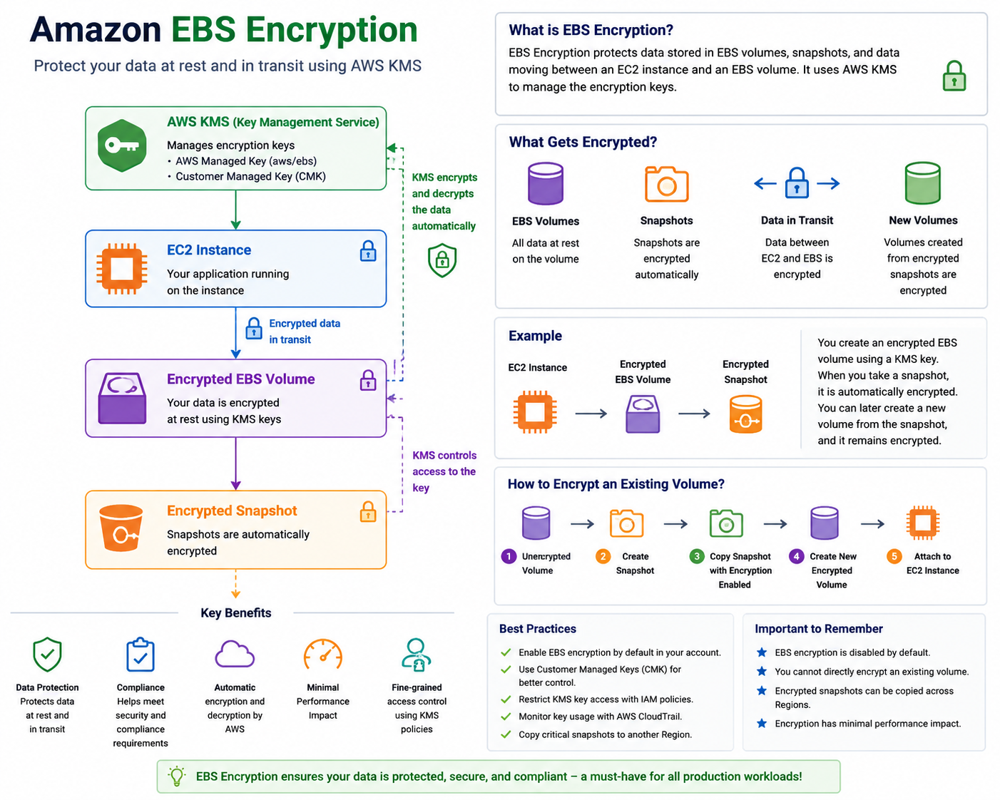

# Amazon EBS Encryption

## What is EBS Encryption?

Amazon EBS Encryption protects data stored in EBS volumes, snapshots, and data moving between an EC2 instance and an EBS volume.

AWS uses AWS Key Management Service (KMS) to manage encryption keys.

### Benefits

* Protects sensitive data
* Meets compliance requirements
* Secures data at rest and in transit
* Minimal performance impact

---

## How EBS Encryption Works

```text
EC2 Instance
      |
      v
Encrypted EBS Volume
      |
      v
AWS KMS Key
```

AWS automatically encrypts and decrypts data without requiring application changes.

---

## What Gets Encrypted?

When EBS Encryption is enabled, AWS encrypts:

### 1. EBS Volumes

```text
EC2
 |
 +-- Encrypted EBS Volume
```

### 2. Snapshots

```text
Encrypted Volume
        |
        v
Encrypted Snapshot
```

### 3. Data in Transit

```text
EC2 <---- Encrypted ----> EBS
```

### 4. Volumes Created from Snapshots

```text
Encrypted Snapshot
         |
         v
Encrypted Volume
```

---

## AWS KMS Integration

EBS uses AWS KMS for encryption key management.

### Types of Keys

#### AWS Managed Key

```text
aws/ebs
```

* Automatically created by AWS
* Easy to use
* No management required

#### Customer Managed Key (CMK)

```text
My-EBS-Key
```

* Full control
* Custom permissions
* Key rotation options

---

## Creating an Encrypted Volume

### AWS Console

```text
EC2
 |
 Create Volume
 |
 Enable Encryption
 |
 Select KMS Key
 |
 Create Volume
```

---

## Encrypting an Existing Unencrypted Volume

You cannot directly encrypt an existing volume.

Use this process:

```text
Unencrypted Volume
        |
 Create Snapshot
        |
 Copy Snapshot
 (Enable Encryption)
        |
 Create New Encrypted Volume
        |
 Attach to EC2
```

---

## Real-World Example

A company stores customer information on an EBS volume.

Requirements:

* Encrypt all customer data
* Meet compliance standards
* Control access to encryption keys

Solution:

```text
EC2
 |
 Encrypted EBS Volume
 |
 Customer Managed KMS Key
```

This ensures data remains protected even if storage is accessed improperly.

---

## Best Practices

### Use Encryption by Default

Enable EBS encryption by default for the AWS account.

### Use Customer Managed Keys

For production workloads requiring strict security controls.

### Restrict KMS Permissions

Grant access only to authorized users and roles.

### Monitor KMS Usage

Use CloudTrail for auditing key usage.

---

## SAP-C03 Exam Tips

Remember:

✓ EBS encryption uses AWS KMS

✓ Encryption protects volumes and snapshots

✓ Data in transit between EC2 and EBS is encrypted

✓ Existing volumes cannot be encrypted directly

✓ Create encrypted copies using snapshots

✓ Encryption has minimal performance impact

---

## Interview Questions

### Q1: What service is used for EBS encryption?

AWS Key Management Service (KMS).

---

### Q2: Does EBS encryption protect snapshots?

Yes.

Encrypted volumes create encrypted snapshots.

---

### Q3: Can you encrypt an existing unencrypted volume directly?

No.

Create a snapshot, copy it with encryption enabled, and create a new volume.

---

### Q4: Is data transferred between EC2 and EBS encrypted?

Yes.

When EBS encryption is enabled, data in transit is also encrypted.

---

### Q5: Does encryption significantly impact performance?

No.

AWS encryption is optimized and has minimal performance overhead.

---

## Quick Revision

```text
EBS Encryption
      |
      +-- AWS KMS
      |
      +-- Encrypts Volumes
      |
      +-- Encrypts Snapshots
      |
      +-- Encrypts Data in Transit
```

### Key Takeaways

✓ Uses AWS KMS

✓ Protects data at rest

✓ Protects data in transit

✓ Encrypts snapshots automatically

✓ Supports AWS-managed and customer-managed keys

✓ Recommended for all production workloads



