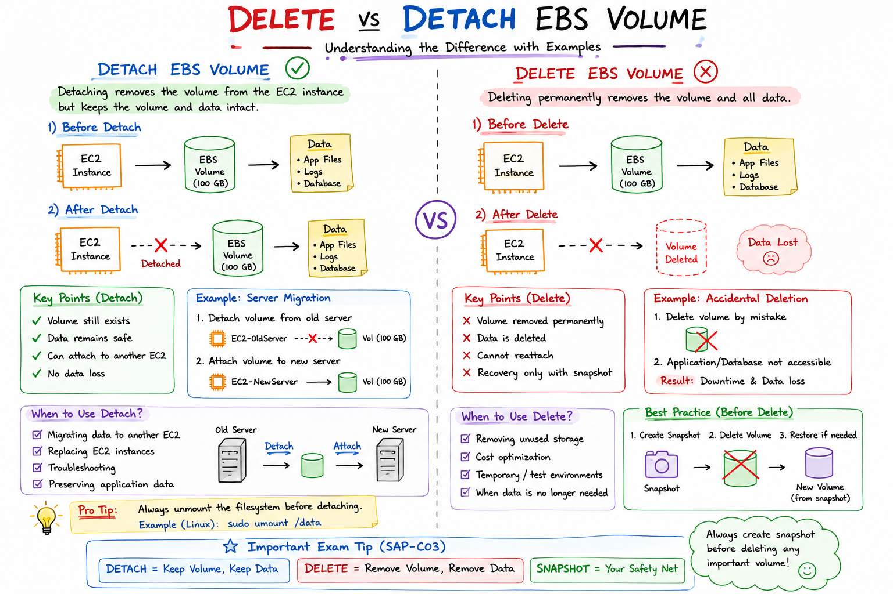

# Delete vs Detach EBS Volume

## Introduction

When working with Amazon EBS volumes, administrators often need to remove a volume from an EC2 instance.

AWS provides two options:

1. Detach Volume
2. Delete Volume

Understanding the difference is important for AWS interviews, SAP-C03 certification, and production environments.

---

## What is Detach?

Detaching an EBS volume removes it from the EC2 instance but keeps the volume and data intact.

### Diagram

```text
Before

EC2 Instance
      |
      v
EBS Volume
      |
      v
Application Data

After Detach

EC2 Instance

EBS Volume
      |
      v
Application Data
```

### Key Points

✓ Volume still exists

✓ Data remains safe

✓ Can attach to another EC2 instance

✓ No data loss

---

## Example

Suppose a server has a 100 GB EBS volume.

```text
EC2-WebServer
      |
      v
EBS Volume (100 GB)
```

You detach the volume:

```text
EC2-WebServer

EBS Volume (100 GB)
```

The data is still available.

You can later attach it to:

```text
EC2-NewServer
      |
      v
EBS Volume (100 GB)
```

---

## What is Delete?

Deleting an EBS volume permanently removes the volume and its data.

### Diagram

```text
Before

EC2 Instance
      |
      v
EBS Volume
      |
      v
Data

After Delete

EC2 Instance

Volume Removed
Data Lost
```

### Key Points

✗ Volume removed permanently

✗ Data deleted

✗ Cannot recover unless snapshot exists

---

## Example

```text
EC2 Instance
      |
      v
EBS Volume
      |
      v
Database Files
```

After Delete:

```text
EC2 Instance

No Volume
No Database Files
```

Recovery is only possible if a snapshot exists.

---

## Delete on Termination

When launching an EC2 instance:

```text
Root Volume
      |
Delete on Termination = True
```

If the EC2 instance is terminated:

```text
Terminate EC2
      |
      v
Root Volume Deleted
```

This is the default behavior for most root volumes.

---

## Delete on Termination Disabled

```text
Root Volume
      |
Delete on Termination = False
```

When the instance is terminated:

```text
Terminate EC2
      |
      v
Volume Survives
```

Useful for preserving data.

---

## Comparison Table

| Feature         | Detach | Delete            |
| --------------- | ------ | ----------------- |
| Volume Exists   | Yes    | No                |
| Data Preserved  | Yes    | No                |
| Reattach Later  | Yes    | No                |
| Recovery Needed | No     | Snapshot Required |
| Risk Level      | Low    | High              |

---

## Real-World Use Cases

### Use Detach When

* Migrating data to another EC2
* Replacing EC2 instances
* Troubleshooting servers
* Preserving application data

### Use Delete When

* Removing unused storage
* Cost optimization
* Temporary environments
* Test resources

---

## Best Practices

### Before Delete

Always create a snapshot.

```text
EBS Volume
      |
      v
Create Snapshot
      |
      v
Delete Volume
```

This ensures data can be recovered later.

---

### Before Detach

Unmount the filesystem first.

Linux Example:

```bash
sudo umount /data
```

Then detach the volume from AWS Console or CLI.

---

## SAP-C03 Exam Tips

Remember:

✓ Detach keeps the data

✓ Delete removes the data

✓ Root volumes often delete on termination

✓ Snapshots provide recovery after deletion

✓ Detach is commonly used for migration

---

## Interview Questions

### Q1: What happens when you detach an EBS volume?

The volume is removed from the EC2 instance, but the data remains intact.

---

### Q2: What happens when you delete an EBS volume?

The volume and all data are permanently removed.

---

### Q3: How can you recover a deleted EBS volume?

Only by restoring from a snapshot.

---

### Q4: Does terminating an EC2 instance always delete EBS volumes?

No. It depends on the "Delete on Termination" setting.

---

## Quick Revision

```text
DETACH
------
EC2 ❌ Volume Connection
Volume ✅
Data ✅

DELETE
------
Volume ❌
Data ❌

Best Practice:
Snapshot → Delete
```

### Key Takeaways

✓ Detach = Keep Data

✓ Delete = Remove Data

✓ Snapshot before Delete

✓ Check Delete-on-Termination setting

✓ Important topic for AWS interviews and SAP-C03
################################################

# Delete vs Detach EBS Volume

## Visual Guide



> Understanding when to **Detach** an EBS volume versus when to **Delete** it is critical for AWS administrators, DevOps engineers, and SAP-C03 certification candidates.

---

## Introduction

When working with Amazon EBS volumes, administrators often need to remove a volume from an EC2 instance.

AWS provides two options:

1. **Detach Volume** – Removes the volume from the EC2 instance while preserving the data.
2. **Delete Volume** – Permanently removes the volume and all data stored on it.

The infographic above provides a quick visual comparison with real-world examples and SAP-C03 exam tips.

---

## Key Takeaways from the Diagram

### Detach

✅ Volume remains available

✅ Data remains safe

✅ Can be attached to another EC2 instance

✅ Useful for server migration

### Delete

❌ Volume removed permanently

❌ Data deleted

❌ Cannot be reattached

❌ Recovery requires a snapshot

### AWS Best Practice

```text
Snapshot → Delete Volume
