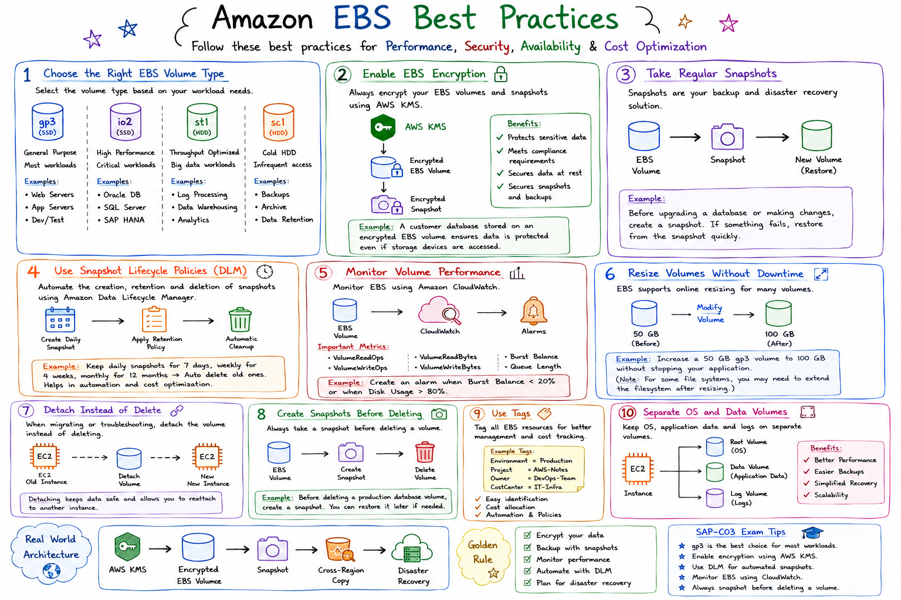

# Amazon EBS Best Practices

## Introduction

Amazon Elastic Block Store (EBS) is widely used for storing operating systems, databases, application files, and logs.

Following EBS best practices improves:

* Performance
* Security
* Availability
* Cost Optimization
* Disaster Recovery

---

# 1. Use the Right EBS Volume Type

Choose the volume type based on workload requirements.

## Diagram

```text
Application
     |
     +----------------+
     |                |
     v                v

gp3 SSD          io2 SSD
General Use      Critical Database

st1 HDD          sc1 HDD
Big Data         Archive
```

## Examples

### gp3

Use for:

* Web Servers
* Application Servers
* Development Environments

### io2

Use for:

* Oracle Database
* SQL Server
* SAP HANA

### st1

Use for:

* Log Processing
* Analytics

### sc1

Use for:

* Backups
* Archive Storage

---

# 2. Enable EBS Encryption

Always encrypt production volumes.

## Diagram

```text
AWS KMS
   |
   v
Encrypted EBS Volume
   |
   v
Encrypted Snapshot
```

## Benefits

✓ Protects sensitive data

✓ Meets compliance requirements

✓ Secures backups

---

## Example

Customer Database:

```text
EC2
 |
 Encrypted EBS
 |
 Customer Records
```

---

# 3. Take Regular Snapshots

Snapshots provide backup and disaster recovery.

## Diagram

```text
EBS Volume
      |
      v
Snapshot
      |
      v
Restore Volume
```

## Example

Before upgrading a database:

```text
Database Volume
       |
Create Snapshot
       |
Apply Upgrade
```

If upgrade fails:

```text
Restore Snapshot
```

---

# 4. Use Snapshot Lifecycle Policies

Automate backups using Amazon Data Lifecycle Manager.

## Diagram

```text
Daily Snapshot
      |
      v
Retention Policy
      |
      v
Automatic Cleanup
```

## Benefits

* Automated backup management
* Reduced manual effort
* Cost optimization

---

# 5. Monitor Volume Performance

Monitor EBS using CloudWatch.

## Diagram

```text
EBS Volume
      |
      v
CloudWatch
      |
      v
Alarms
```

### Metrics

* VolumeReadOps
* VolumeWriteOps
* VolumeReadBytes
* VolumeWriteBytes
* Burst Balance

---

## Example

Alert when:

```text
Disk Usage > 80%
```

---

# 6. Resize Volumes Without Downtime

EBS supports online resizing.

## Example

Before:

```text
50 GB Volume
```

After:

```text
100 GB Volume
```

### Benefits

✓ No migration required

✓ No application downtime

---

# 7. Detach Instead of Delete

When migrating servers:

## Good Practice

```text
EC2 Old
    |
Detach Volume
    |
Attach
    |
EC2 New
```

### Avoid

```text
Delete Volume
```

Without backup.

---

# 8. Create Snapshots Before Deleting

Always follow:

```text
Volume
   |
Snapshot
   |
Delete
```

### Example

Before deleting:

```text
Production Database
```

Create:

```text
Database Snapshot
```

---

# 9. Use Tags

Tag all EBS resources.

## Example

```text
Environment = Production
Project = AWS-Notes
Owner = DevOps-Team
```

Benefits:

* Easy management
* Cost tracking
* Automation

---

# 10. Separate OS and Data Volumes

Recommended Architecture

```text
EC2 Instance
      |
      +-- Root Volume
      |
      +-- Data Volume
      |
      +-- Log Volume
```

Benefits:

✓ Easier backups

✓ Better performance

✓ Simplified recovery

---

# Real-World Architecture

```text
                 AWS KMS
                     |
                     v
             Encrypted EBS
                     |
                     v
                  Snapshot
                     |
                     v
            Cross-Region Copy
                     |
                     v
              Disaster Recovery
```

---

# Interview Questions

### Q1: What is the best EBS volume for most workloads?

gp3

---

### Q2: How do you protect EBS data?

Enable encryption and take regular snapshots.

---

### Q3: How can you automate EBS backups?

Amazon Data Lifecycle Manager (DLM).

---

### Q4: What should you do before deleting a volume?

Create a snapshot.

---

### Q5: How do you monitor EBS performance?

Amazon CloudWatch.

---

# SAP-C03 Exam Tips

Remember:

✓ Use gp3 for general workloads

✓ Enable encryption using AWS KMS

✓ Take regular snapshots

✓ Automate backups with DLM

✓ Monitor with CloudWatch

✓ Use tags

✓ Separate OS and application data

✓ Snapshot before Delete

---

# Quick Revision Cheat Sheet

```text
Best Practices

✓ gp3 for most workloads
✓ Encrypt with KMS
✓ Take Snapshots
✓ Use DLM
✓ Monitor with CloudWatch
✓ Use Tags
✓ Separate Data Volumes
✓ Snapshot Before Delete
```

## Key Takeaways

* Security = Encryption
* Backup = Snapshots
* Monitoring = CloudWatch
* Automation = DLM
* Performance = Correct Volume Type
* Recovery = Snapshot Restore


