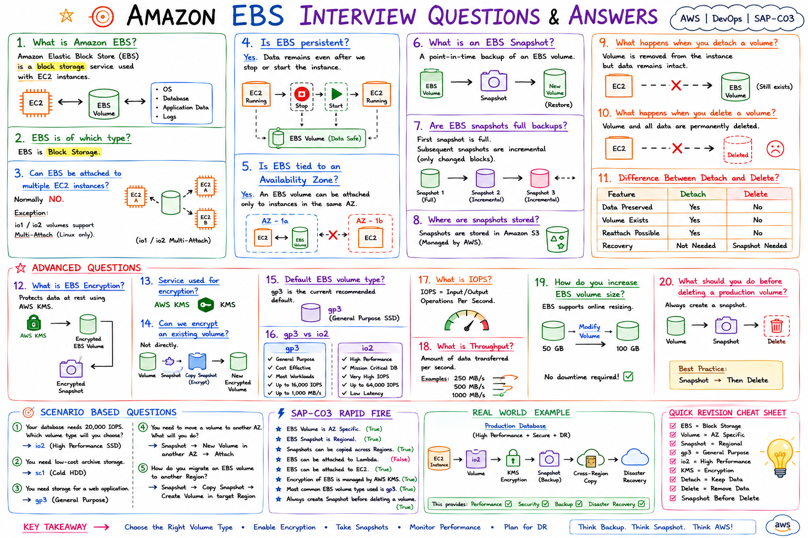

# Amazon EBS Interview Questions and Answers

## Introduction

Amazon Elastic Block Store (EBS) is one of the most commonly used AWS storage services.

These questions are frequently asked in:

* AWS Interviews
* DevOps Interviews
* Cloud Engineer Interviews
* SAP-C03 Certification

---

# Beginner Level Questions

## 1. What is Amazon EBS?

Amazon Elastic Block Store (EBS) is a block storage service used with EC2 instances.

Think of EBS as a virtual hard disk attached to an EC2 server.

### Example

```text
EC2 Instance
      |
      v
EBS Volume
```

---

## 2. What type of storage is EBS?

EBS is Block Storage.

Examples:

* Operating System
* Databases
* Application Data
* Log Files

---

## 3. Can EBS be attached to multiple EC2 instances?

Normally No.

Exception:

```text
io1/io2 Multi-Attach
```

supports attachment to multiple EC2 instances.

---

## 4. Is EBS persistent?

Yes.

Data remains available even after:

```text
Stop Instance
Start Instance
```

---

## 5. Is EBS tied to an Availability Zone?

Yes.

Example:

```text
Mumbai
 └── ap-south-1a
       └── EBS Volume
```

The volume cannot be directly attached to an instance in another AZ.

---

# Intermediate Level Questions

## 6. What is an EBS Snapshot?

A point-in-time backup of an EBS volume.

### Example

```text
EBS Volume
     |
     v
Snapshot
     |
     v
New Volume
```

---

## 7. Are EBS snapshots full backups?

First Snapshot:

```text
100 GB
```

Subsequent Snapshots:

```text
Only Changed Blocks
```

Snapshots are incremental.

---

## 8. Where are EBS Snapshots stored?

AWS stores snapshots in Amazon S3 (managed internally).

---

## 9. What happens when you detach an EBS volume?

```text
EC2 Instance
      X
EBS Volume
```

Volume remains available.

Data remains intact.

---

## 10. What happens when you delete an EBS volume?

```text
Volume Deleted
Data Deleted
```

Recovery requires a snapshot.

---

## 11. Difference Between Delete and Detach?

| Feature        | Detach | Delete |
| -------------- | ------ | ------ |
| Data Preserved | Yes    | No     |
| Volume Exists  | Yes    | No     |
| Reattach       | Yes    | No     |

---

## 12. What is EBS Encryption?

EBS Encryption protects:

* Volumes
* Snapshots
* Data in Transit

using AWS KMS.

---

## 13. What AWS Service is Used for EBS Encryption?

Answer:

```text
AWS KMS
```

---

## 14. Can you encrypt an existing EBS volume?

Not directly.

Process:

```text
Volume
   |
Snapshot
   |
Copy Snapshot (Encrypt)
   |
New Encrypted Volume
```

---

## 15. What is the default EBS volume type?

Current recommendation:

```text
gp3
```

---

# Advanced Questions

## 16. Difference Between gp3 and io2?

### gp3

* General Purpose SSD
* Cost Effective
* Most Workloads

### io2

* High Performance SSD
* Mission-Critical Databases
* Very High IOPS

---

## 17. What is IOPS?

IOPS means:

```text
Input Output Operations Per Second
```

Higher IOPS means better disk performance.

---

## 18. What is Throughput?

Amount of data transferred per second.

Example:

```text
250 MB/s
500 MB/s
1000 MB/s
```

---

## 19. How do you increase EBS volume size?

AWS supports online resizing.

Example:

```text
50 GB
  |
Modify Volume
  |
100 GB
```

---

## 20. What should you do before deleting a production volume?

Answer:

```text
Create Snapshot
```

AWS Best Practice:

```text
Snapshot -> Delete
```

---

# Scenario-Based Questions

## 21. Your database requires 20,000 IOPS. Which volume type would you choose?

Answer:

```text
io2
```

Reason:

High-performance SSD with high IOPS support.

---

## 22. You need a low-cost archive storage volume.

Answer:

```text
sc1
```

---

## 23. You need storage for a web application.

Answer:

```text
gp3
```

---

## 24. An EBS volume must be moved to another Availability Zone. What would you do?

Answer:

```text
Create Snapshot
      |
Create New Volume
      |
Attach to EC2
```

---

## 25. How do you migrate an EBS volume to another Region?

Answer:

```text
Volume
   |
Snapshot
   |
Copy Snapshot
   |
Create Volume
```

---

# SAP-C03 Rapid Fire Questions

### Is EBS Regional?

❌ No

EBS Volume = AZ Specific

---

### Are Snapshots Regional?

✅ Yes

---

### Can snapshots be copied across Regions?

✅ Yes

---

### Can EBS be attached to Lambda?

❌ No

---

### Can EBS be attached to EC2?

✅ Yes

---

### Which service manages EBS encryption?

✅ AWS KMS

---

### What is the most common EBS volume type?

✅ gp3

---

### What should be created before deleting a volume?

✅ Snapshot

---

# Real Interview Question

### Question

A production database is running on EBS. Management requires:

* High Performance
* Encryption
* Backup
* Disaster Recovery

Which AWS services would you use?

### Answer

```text
io2 Volume
      |
AWS KMS Encryption
      |
EBS Snapshots
      |
Cross-Region Snapshot Copy
```

This provides:

✓ Performance

✓ Security

✓ Backup

✓ Disaster Recovery

---

# Quick Revision Sheet

```text
EBS = Block Storage

gp3 = General Purpose

io2 = High Performance

Snapshot = Backup

KMS = Encryption

Detach = Keep Data

Delete = Remove Data

Volume = AZ Specific

Snapshot = Regional

Snapshot Before Delete
```

## Final Interview Tip

If an interviewer asks:

"What is the safest way to remove an EBS volume?"

Answer:

```text
Create Snapshot
      |
Detach Volume
      |
Delete Only If Required
```

This demonstrates good AWS operational practices and production experience.



