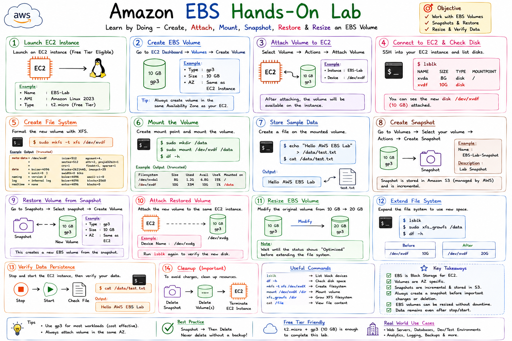

# Amazon EBS Hands-On Lab

## Objective

In this lab, you will learn how to:

* Create an EBS Volume
* Attach the Volume to an EC2 Instance
* Format and Mount the Volume
* Store Data
* Create a Snapshot
* Restore a Volume from Snapshot
* Resize the Volume
* Verify Data Persistence

---

# Lab Architecture

```text
                  AWS Cloud
                       |
                       v

                +-------------+
                | EC2 Instance|
                +-------------+
                       |
                       v

                +-------------+
                | EBS Volume  |
                |   10 GB     |
                +-------------+
                       |
                       v

                +-------------+
                | Snapshot    |
                +-------------+
                       |
                       v

                +-------------+
                | New Volume  |
                +-------------+
```

---

# Prerequisites

Before starting:

✓ AWS Account

✓ EC2 Instance Running

✓ SSH Access

✓ Basic Linux Commands

---

# Step 1: Launch EC2 Instance

Navigate:

```text
AWS Console
    |
EC2
    |
Launch Instance
```

Example:

```text
Name: EBS-Lab
AMI : Amazon Linux 2023
Type: t2.micro
```

Launch the instance.

---

# Step 2: Create EBS Volume

Navigate:

```text
EC2
 |
Elastic Block Store
 |
Volumes
 |
Create Volume
```

Configuration:

```text
Volume Type : gp3
Size        : 10 GB
AZ          : Same as EC2
```

Create Volume.

---

# Step 3: Attach Volume to EC2

Select Volume:

```text
Actions
   |
Attach Volume
```

Example:

```text
Instance : EBS-Lab
Device   : /dev/xvdf
```

Result:

```text
EC2 Instance
      |
      v
EBS Volume Attached
```

---

# Step 4: Connect to EC2

SSH into the instance:

```bash
ssh -i key.pem ec2-user@PUBLIC-IP
```

Verify attached disks:

```bash
lsblk
```

Expected Output:

```text
xvda   8:0    0   8G
xvdf   202:80 0  10G
```

---

# Step 5: Create File System

Format the volume:

```bash
sudo mkfs -t xfs /dev/xvdf
```

Example Output:

```text
meta-data=/dev/xvdf
data blocks=...
```

---

# Step 6: Create Mount Point

```bash
sudo mkdir /data
```

Mount volume:

```bash
sudo mount /dev/xvdf /data
```

Verify:

```bash
df -h
```

Expected:

```text
/dev/xvdf 10G mounted on /data
```

---

# Step 7: Store Sample Data

Create a file:

```bash
echo "Hello AWS EBS Lab" > /data/test.txt
```

Verify:

```bash
cat /data/test.txt
```

Output:

```text
Hello AWS EBS Lab
```

---

# Step 8: Create Snapshot

Navigate:

```text
Volumes
   |
Select Volume
   |
Create Snapshot
```

Example:

```text
Name : EBS-Lab-Snapshot
```

Result:

```text
Volume
   |
Snapshot Created
```

---

# Step 9: Restore Volume from Snapshot

Navigate:

```text
Snapshots
   |
Select Snapshot
   |
Create Volume
```

Configuration:

```text
Type : gp3
Size : 10 GB
```

Create Volume.

---

# Step 10: Attach Restored Volume

Attach the new volume:

```text
Attach Volume
```

Example:

```text
Device Name : /dev/xvdg
```

Verify:

```bash
lsblk
```

---

# Step 11: Resize EBS Volume

Modify volume:

```text
Volumes
   |
Modify Volume
```

Change:

```text
10 GB
  |
20 GB
```

Wait until optimization completes.

---

# Step 12: Extend File System

Check size:

```bash
lsblk
```

Grow filesystem:

```bash
sudo xfs_growfs /data
```

Verify:

```bash
df -h
```

Expected:

```text
20 GB
```

---

# Verify Data Persistence

Stop EC2:

```text
EC2
 |
Stop Instance
```

Start EC2 again.

Check file:

```bash
cat /data/test.txt
```

Expected:

```text
Hello AWS EBS Lab
```

Data remains available.

---

# Cleanup

To avoid charges:

```text
Delete Snapshot
Delete Volume
Terminate EC2
```

---

# Real-World Scenario

A company needs:

* Database Storage
* Backup
* Disaster Recovery

Solution:

```text
EC2
 |
EBS Volume
 |
Snapshot
 |
Cross-Region Copy
 |
Disaster Recovery
```

---

# Lab Summary

In this lab you learned:

✓ Create EBS Volume

✓ Attach to EC2

✓ Format Volume

✓ Mount Volume

✓ Store Data

✓ Create Snapshot

✓ Restore Volume

✓ Resize Volume

✓ Verify Persistence

---

# Interview Questions

### Q1: How do you attach an EBS volume?

Create the volume and use Attach Volume from the EC2 console.

---

### Q2: How do you check attached disks in Linux?

```bash
lsblk
```

---

### Q3: How do you create a filesystem?

```bash
mkfs -t xfs /dev/xvdf
```

---

### Q4: How do you mount a volume?

```bash
mount /dev/xvdf /data
```

---

### Q5: How do you create a backup?

Create an EBS Snapshot.

---

# SAP-C03 Key Takeaways

```text
EBS = Block Storage

Volume = AZ Specific

Snapshot = Regional

gp3 = Recommended

KMS = Encryption

Snapshot Before Delete

Resize Without Downtime
```


# Amazon EBS Hands-On Lab



> Complete step-by-step practical guide to create, attach, mount, snapshot, restore, and resize Amazon EBS volumes.
