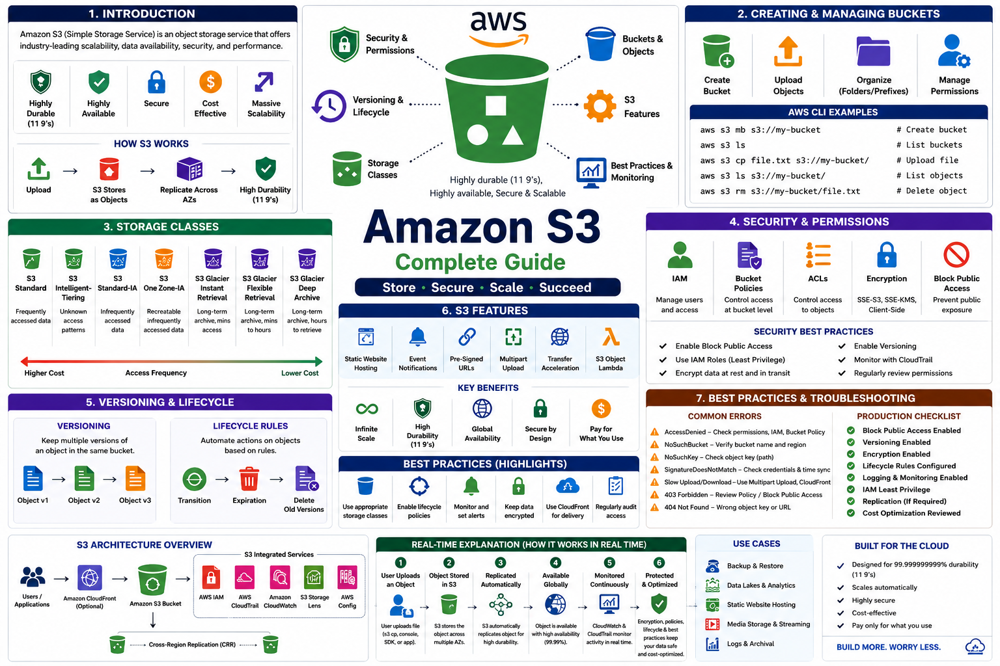

# ☁️ AWS S3 Notes

<p align="center">
  
</p>

<p align="center">


</p>

---

## 📖 Overview

This repository contains **comprehensive Amazon S3 notes** designed for beginners, students, cloud engineers, and professionals preparing for AWS interviews or certifications.

The documentation explains Amazon S3 concepts from the ground up with clear explanations, architecture diagrams, best practices, and practical use cases.

Whether you're learning Amazon S3 for the first time or revising before an interview, this repository serves as a structured reference.

---

## 🎯 Learning Objectives

By completing this guide, you will learn:

- ✅ Amazon S3 Fundamentals
- ✅ Buckets & Objects
- ✅ Storage Classes
- ✅ IAM & Bucket Security
- ✅ Versioning & Lifecycle Policies
- ✅ Static Website Hosting
- ✅ Event Notifications
- ✅ Pre-Signed URLs
- ✅ Multipart Upload
- ✅ Transfer Acceleration
- ✅ Best Practices
- ✅ Cost Optimization
- ✅ Troubleshooting
- ✅ Production-Ready S3 Architecture

---

# 📚 Documentation

| No | Document | Description |
|----|----------|-------------|
| 01 | [Introduction](01-Introduction.md) | Amazon S3 fundamentals, architecture, concepts, and use cases |
| 02 | [Creating & Managing Buckets](02-Creating-and-Managing-Buckets.md) | Buckets, objects, folders, AWS CLI, and object management |
| 03 | [Storage Classes](03-Storage-Classes.md) | All S3 storage classes with comparison and real-world scenarios |
| 04 | [Security & Permissions](04-Security-and-Permissions.md) | IAM, Bucket Policies, ACLs, Encryption, and Block Public Access |
| 05 | [Versioning & Lifecycle](05-Versioning-and-Lifecycle.md) | Versioning, Lifecycle Rules, Replication, and Recovery |
| 06 | [S3 Features](06-S3-Features.md) | Static Website Hosting, Event Notifications, Pre-Signed URLs, Multipart Upload |
| 07 | [Best Practices & Troubleshooting](07-Best-Practices-and-Troubleshooting.md) | Security, optimization, troubleshooting, and interview questions |

---

# 🗂 Repository Structure

```text
AWS-Notes-S3/
│
├── images/
│   └── aws-s3-overview.png
│
├── 01-Introduction.md
├── 02-Creating-and-Managing-Buckets.md
├── 03-Storage-Classes.md
├── 04-Security-and-Permissions.md
├── 05-Versioning-and-Lifecycle.md
├── 06-S3-Features.md
├── 07-Best-Practices-and-Troubleshooting.md
│
└── README.md
```

---

# 🧭 Learning Roadmap

```text
Amazon S3
     │
     ▼
Introduction
     │
     ▼
Buckets & Objects
     │
     ▼
Storage Classes
     │
     ▼
Security & Permissions
     │
     ▼
Versioning & Lifecycle
     │
     ▼
Advanced Features
     │
     ▼
Best Practices
     │
     ▼
Production Ready
```

---

# 🚀 Skills You'll Gain

- Amazon S3 Fundamentals
- AWS Cloud Storage
- Bucket Management
- Object Management
- IAM Security
- Bucket Policies
- Encryption
- Versioning
- Lifecycle Management
- Static Website Hosting
- Storage Optimization
- Cost Optimization
- Disaster Recovery
- Monitoring & Logging
- AWS CLI
- Troubleshooting
- Interview Preparation

---

# 💼 Who Is This Repository For?

- Students learning AWS
- Beginners exploring Cloud Computing
- AWS Certified Cloud Practitioner candidates
- AWS Solutions Architect candidates
- DevOps Engineers
- Cloud Engineers
- Backend Developers
- Technical Interview Preparation

---

# ⏱ Reading Time

| Document | Estimated Time |
|----------|---------------:|
| 01 - Introduction | 04:20 |
| 02 - Creating & Managing Buckets | 04:28 |
| 03 - Storage Classes | 04:37 |
| 04 - Security & Permissions | 04:47 |
| 05 - Versioning & Lifecycle | 05:01 |
| 06 - S3 Features | 05:14 |
| 07 - Best Practices & Troubleshooting | 05:21 |

**📖 Total Reading Time:** **33 Minutes 48 Seconds**

---

# 🌟 Key Features

- Beginner-Friendly
- Structured Learning Path
- GitHub Markdown Documentation
- AWS Best Practices
- Real-World Examples
- Architecture Concepts
- AWS CLI Commands
- Interview Questions
- Production Recommendations

---

# 🤝 Contributions

Contributions, improvements, and suggestions are always welcome.

If you find this repository helpful:

⭐ Star the repository

🍴 Fork the repository

🐛 Report issues

📥 Submit pull requests

---

# 📜 License

This project is licensed under the MIT License.

---

# 👨‍💻 Author

**Your Name**

If you found this repository helpful, consider giving it a ⭐ on GitHub.

Happy Learning! 🚀
