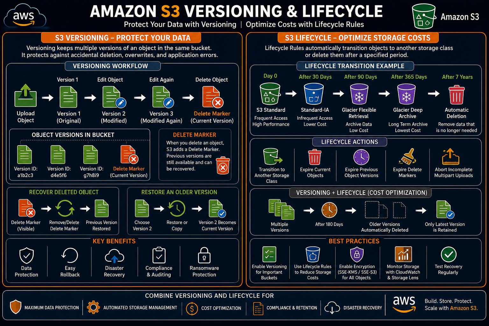

# Amazon S3 Versioning and Lifecycle — Complete Guide

## Introduction

In a production environment, data is constantly updated, overwritten, and sometimes accidentally deleted. Losing important files can lead to downtime, financial loss, or compliance issues.

Amazon S3 provides two powerful features to solve these challenges:

- **Versioning** – Protects objects by keeping multiple versions of the same file.
- **Lifecycle Management** – Automatically manages objects throughout their lifecycle to optimize storage costs.

Together, these features help organizations build reliable, secure, and cost-effective storage solutions.

In this guide, you'll learn how Versioning and Lifecycle Rules work, how to configure them, and how they are used in real-world AWS environments — from version IDs and delete markers through lifecycle rules, cost optimization strategies, and troubleshooting.

---

# Amazon S3 Versioning and Lifecycle

## Introduction

...

<p align="center">
  
</p>


---
## What is Amazon S3 Versioning?

Amazon S3 Versioning is a feature that preserves multiple versions of an object in the same bucket.

Whenever an object is modified or uploaded with the same name, Amazon S3 creates a **new version** instead of replacing the existing one.

This protects data from:

- Accidental deletion
- Accidental overwrites
- Application errors
- Ransomware attacks

Think of Versioning like the **"Version History"** feature in a document editor, where every saved change creates a new version that can be restored later.

---

## Why is Versioning Important?

Without Versioning:

```
Upload report.pdf
↓
Edit report.pdf
↓
Old File Lost Forever
```

With Versioning:

```
Upload report.pdf
↓
Version 1
↓
Edit report.pdf
↓
Version 2
↓
Edit report.pdf
↓
Version 3
↓
All Versions Are Preserved
```

Instead of replacing the original object, Amazon S3 stores every version separately.

This makes it easy to recover previous versions whenever required.

---

## How Versioning Works

Every object stored in a version-enabled bucket receives a unique **Version ID**.

Example:

```
Bucket
↓
project-report.pdf

├── Version ID: a1b2c3
├── Version ID: d4e5f6
├── Version ID: g7h8i9
```

Even though the object name remains the same, Amazon S3 distinguishes each version using its unique Version ID.

### Understanding Version IDs

A **Version ID** is a unique identifier automatically assigned to every version of an object.

Example:

| File Name | Version ID |
|-----------|------------|
| report.pdf | v1-8F3A |
| report.pdf | v2-B92X |
| report.pdf | v3-K71P |

When downloading or restoring a file, you can choose a specific Version ID instead of always retrieving the latest version.

---

## Versioning States

Amazon S3 buckets can exist in one of three Versioning states.

### 1. Never Enabled

Versioning has never been turned on.

```
Bucket
↓
Upload File
↓
Overwrite File
↓
Previous Version Lost
```

Only the latest object exists.

### 2. Enabled

Versioning is active. Every upload creates a new version.

```
Upload
↓
Version 1
↓
Modify
↓
Version 2
↓
Modify
↓
Version 3
```

This is the recommended configuration for production workloads.

### 3. Suspended

Versioning was enabled in the past but is currently suspended.

```
Existing Versions
↓
Remain Available

New Uploads
↓
No New Versions Created
```

Previously stored versions remain intact, but new uploads no longer generate additional versions until Versioning is re-enabled.

---

## Real-World Example: Application Configuration Files

Imagine a software company stores application configuration files in Amazon S3.

```
application-config/
↓
config.json
↓
Version 1
↓
Developer Updates File
↓
Version 2
↓
Developer Updates Again
↓
Version 3
```

If a faulty deployment occurs, the operations team can quickly restore **Version 2** instead of manually recreating the configuration.

This minimizes downtime and simplifies rollback during production incidents.

---

## Benefits of Versioning

Amazon S3 Versioning provides several advantages:

**Data Protection** — Recover accidentally deleted or overwritten files.

**Easy Rollback** — Restore previous versions during application failures or deployment issues.

**Disaster Recovery** — Maintain historical copies of important business data.

**Compliance** — Many industries require historical records for auditing and regulatory purposes.

**Ransomware Protection** — If malicious software encrypts or modifies objects, previous versions remain available for recovery.

### Common Use Cases

Versioning is widely used for:

- Database backups
- Application configuration files
- Source code archives
- Business documents
- Financial reports
- Medical records
- Infrastructure backups

### Versioning Best Practices

- Enable Versioning on production buckets.
- Combine Versioning with Lifecycle Rules to control storage costs.
- Enable Server-Side Encryption for all versions.
- Monitor version growth to avoid unnecessary storage charges.
- Regularly test object recovery procedures.

---

## Delete Markers & Object Recovery

One of the biggest advantages of Amazon S3 Versioning is that deleting an object does **not** immediately remove it from the bucket.

Instead, Amazon S3 adds a **Delete Marker**, allowing you to recover the object later if needed.

This feature protects against accidental deletion and makes Versioning an essential part of backup and disaster recovery strategies.

### What Happens When You Delete an Object?

The behavior depends on whether Versioning is enabled.

**Without Versioning**

```
Bucket
↓
Delete report.pdf
↓
Object Permanently Deleted
```

Once deleted, the object cannot be recovered.

**With Versioning Enabled**

```
Bucket
↓
report.pdf
↓
Delete Object
↓
Delete Marker Created
↓
Previous Versions Still Exist
```

The object appears deleted, but all previous versions remain safely stored.

### What is a Delete Marker?

A **Delete Marker** is a special placeholder created when you delete an object from a version-enabled bucket.

It becomes the latest version of the object.

Example:

```
report.pdf

│
├── Version 1
├── Version 2
├── Version 3
└── Delete Marker ← Current Version
```

The original versions are still stored inside the bucket.

### How Delete Markers Work

Imagine you upload a file several times.

```
Upload report.pdf
↓
Version 1
↓
Modify File
↓
Version 2
↓
Modify Again
↓
Version 3
↓
Delete File
↓
Delete Marker
```

Now:

- Users cannot see the file normally.
- Previous versions still exist.
- The file can be restored by removing the Delete Marker.

### Viewing Object Versions

When Versioning is enabled, the S3 Console allows you to display every version of an object.

Example:

```
report.pdf

├── Version 3
├── Version 2
├── Version 1
└── Delete Marker
```

This makes it easy to identify and restore older versions.

### Recovering a Deleted Object

Recovering a deleted object is simple.

Steps:

1. Open the S3 Bucket.
2. Enable **Show Versions**.
3. Locate the Delete Marker.
4. Delete the Delete Marker.
5. The latest valid object version becomes available again.

Workflow:

```
Delete Marker
↓
Delete Delete Marker
↓
Version 3 Restored
```

No data is copied or recreated — the previous version simply becomes the current version.

### Recovering an Older Version

Sometimes the latest version is incorrect, but the object hasn't been deleted.

Example:

```
Version 1
↓
Version 2
↓
Version 3 (Corrupted)
```

Instead of using Version 3, you can restore Version 2.

```
Current Version
↓
Select Version 2
↓
Copy or Restore
↓
Version 2 Becomes Current
```

This feature is extremely useful during deployment failures.

### Permanently Deleting an Object

Deleting an object normally only creates a Delete Marker.

To permanently remove data, you must delete **every version** of the object.

Example:

```
report.pdf

├── Version 1
├── Version 2
├── Version 3
└── Delete Marker

↓

Delete All Versions
↓
Object Permanently Removed
```

Until every version is deleted, storage charges continue to apply.

### Storage Impact

Each object version consumes storage space.

Example:

```
Version 1 → 20 MB
Version 2 → 22 MB
Version 3 → 24 MB

Total Storage Used
66 MB
```

Although Versioning improves data protection, it also increases storage usage.

Lifecycle Rules can automatically remove old versions to reduce costs.

### Real-World Scenario: Salary Reports

A company stores employee salary reports.

```
salary-report.xlsx
↓
Version 1
↓
Finance Team Updates File
↓
Version 2
↓
Accidental Delete
↓
Delete Marker
```

Instead of recreating the report, the administrator simply removes the Delete Marker and restores Version 2 within minutes.

### Versioning + Recovery Workflow

```
Upload Object
↓
Version 1
↓
Modify Object
↓
Version 2
↓
Modify Object
↓
Version 3
↓
Delete Object
↓
Delete Marker
↓
Restore Needed?
↓
Delete Delete Marker
↓
Version 3 Restored
```

This workflow protects against accidental deletion without requiring backups.

### Common Mistakes (Versioning & Delete Markers)

**❌ Assuming Delete Means Permanent** — With Versioning enabled, deleting an object usually creates a Delete Marker. The data still exists.

**❌ Forgetting Old Versions Consume Storage** — Every version is billed separately. Use Lifecycle Rules to automatically remove old versions.

**❌ Deleting Only the Latest Version** — Removing only the latest version does not permanently delete the object. Previous versions remain available.

**❌ Not Testing Recovery** — Organizations should periodically verify that deleted objects can be successfully restored.

### Best Practices (Delete Markers & Recovery)

- Enable Versioning for production buckets.
- Regularly review stored object versions.
- Use Lifecycle Rules to expire old versions.
- Monitor storage costs caused by multiple versions.
- Test object recovery as part of disaster recovery planning.

---

## Lifecycle Management

As data grows over time, not every object needs to remain in high-performance storage forever.

For example:

- Daily application logs are frequently accessed for the first few weeks.
- Backup files are rarely accessed after a few months.
- Compliance records may need to be retained for several years.

Instead of manually moving or deleting these objects, Amazon S3 **Lifecycle Management** automates the entire process.

Lifecycle Rules help organizations reduce storage costs, automate data management, meet compliance requirements, and simplify backup retention.

### What is an S3 Lifecycle Rule?

A **Lifecycle Rule** is a set of instructions that tells Amazon S3 what action to perform on objects after a specified period.

Common lifecycle actions include:

- Transition objects to a cheaper storage class
- Delete current object versions
- Delete previous object versions
- Remove incomplete multipart uploads

```
Upload Object
↓
Amazon S3 Standard
↓
Lifecycle Rule
↓
Automatic Transition
↓
Cheaper Storage Class
```

Lifecycle Rules eliminate the need for manual storage management.

### Lifecycle Rule Components

A Lifecycle Rule typically contains:

- Rule Name
- Scope (Entire Bucket or Specific Prefix)
- Object Filter (Optional)
- Transition Action
- Expiration Action
- Status (Enabled/Disabled)

Example:

```
Rule Name:
Archive Old Logs
↓
Objects:
logs/
↓
After 30 Days
↓
Move to Standard-IA
↓
After 90 Days
↓
Move to Glacier Flexible Retrieval
↓
After 365 Days
↓
Delete Object
```

### Transition Actions

A **Transition Action** automatically moves an object to another storage class after a specified number of days.

Example workflow:

```
Day 0
↓
S3 Standard
↓
Day 30
↓
Standard-IA
↓
Day 90
↓
Glacier Flexible Retrieval
↓
Day 365
↓
Deep Archive
```

The object remains available but is stored at a lower cost.

**Storage Class Transition Example**

Suppose an application uploads log files every day.

Initially: `logs/app.log` → Amazon S3 Standard

After 30 days: `logs/app.log` → Standard-IA

After 90 days: `logs/app.log` → Glacier Flexible Retrieval

After one year: `logs/app.log` → Glacier Deep Archive

The application doesn't need to move the files manually — Amazon S3 handles everything automatically.

### Expiration Actions

Lifecycle Rules can also automatically delete objects that are no longer needed.

Example:

```
Temporary Files
↓
30 Days
↓
Automatically Deleted
```

Common use cases:

- Temporary uploads
- Old log files
- Expired reports
- Build artifacts
- Cache files

Automatic expiration helps reduce storage costs and keeps buckets organized.

### Managing Previous Object Versions

When Versioning is enabled, Lifecycle Rules can remove older versions automatically.

Example:

```
report.pdf
↓
Version 1
↓
Version 2
↓
Version 3
↓
Keep Latest Version
↓
Delete Older Versions After 180 Days
```

This balances data protection with cost optimization.

### Removing Delete Markers

Lifecycle Rules can also remove **Expired Delete Markers**.

Example:

```
Delete Marker
↓
No Previous Versions Exist
↓
Lifecycle Rule
↓
Delete Marker Removed
```

This helps clean up buckets over time.

### Incomplete Multipart Upload Cleanup

Sometimes large file uploads are interrupted before completion.

These incomplete uploads still consume storage. Lifecycle Rules can automatically remove them.

```
Large File Upload
↓
Connection Lost
↓
Incomplete Multipart Upload
↓
7 Days
↓
Automatically Deleted
```

This prevents unnecessary storage charges.

### Real-World Scenario: Media Company Videos

A media company uploads video recordings every day.

```
Video Uploaded
↓
Amazon S3 Standard
↓
30 Days
↓
Standard-IA
↓
180 Days
↓
Glacier Flexible Retrieval
↓
5 Years
↓
Delete Automatically
```

Benefits:

- Recent videos remain quickly accessible.
- Older videos are archived.
- Long-term storage costs are minimized.
- Retention policies are enforced automatically.

### Lifecycle Workflow

```
Upload Object
↓
S3 Standard
↓
30 Days
↓
Standard-IA
↓
90 Days
↓
Glacier Flexible Retrieval
↓
365 Days
↓
Deep Archive
↓
7 Years
↓
Automatic Deletion
```

This is one of the most common lifecycle strategies used in enterprise environments.

### Lifecycle Rule Example

Suppose your company stores application logs.

| Time After Upload | Action |
|-------------------|--------|
| Day 0 | Store in S3 Standard |
| Day 30 | Move to Standard-IA |
| Day 90 | Move to Glacier Flexible Retrieval |
| Day 365 | Move to Glacier Deep Archive |
| Day 2555 (7 Years) | Delete Object |

This rule ensures that storage costs decrease as the data becomes less frequently accessed.

### Benefits of Lifecycle Management

**Cost Optimization** — Automatically move data to lower-cost storage classes.

**Automation** — No manual intervention required after rules are configured.

**Compliance** — Retain data for the required period before automatic deletion.

**Operational Simplicity** — AWS manages transitions and expiration automatically.

**Storage Optimization** — Removes unnecessary files and old object versions.

### Lifecycle Management Best Practices

- Create Lifecycle Rules for every production bucket.
- Transition infrequently accessed data to lower-cost storage classes.
- Delete temporary objects automatically.
- Configure expiration rules for old object versions.
- Remove incomplete multipart uploads.
- Test Lifecycle Rules in non-production environments before deployment.

---

## Lifecycle Strategies & Cost Optimization

As data grows over time, storage costs can increase significantly if objects remain in high-performance storage indefinitely.

Amazon S3 Lifecycle Rules help organizations automatically move data to lower-cost storage classes and remove unnecessary objects when they are no longer needed.

A well-designed Lifecycle strategy can reduce storage costs while maintaining data availability and compliance.

### Why Cost Optimization Matters

Imagine an application generates 500 GB of log files every month.

Without Lifecycle Rules:

```
Application Logs
↓
Amazon S3 Standard
↓
1 Year Later
↓
6 TB Stored in Standard
↓
High Storage Cost
```

With Lifecycle Rules:

```
Application Logs
↓
S3 Standard
↓
Standard-IA
↓
Glacier Flexible Retrieval
↓
Deep Archive
↓
Automatic Deletion
```

The same data is stored much more economically.

### Designing a Lifecycle Strategy

Before creating Lifecycle Rules, ask these questions:

- How frequently is the data accessed?
- How long should the data be retained?
- Is the data required for compliance?
- Can archived data tolerate retrieval delays?
- When should the data be deleted?

Answering these questions helps determine the best storage lifecycle.

### Example 1 – Application Logs

Application logs are accessed frequently for troubleshooting during the first few weeks.

| Time | Storage Class |
|------|---------------|
| Day 0 | S3 Standard |
| Day 30 | Standard-IA |
| Day 90 | Glacier Flexible Retrieval |
| Day 365 | Delete |

Benefits: lower storage costs, automatic cleanup, no manual intervention.

### Example 2 – Database Backups

Database backups are critical and should be retained longer.

```
Daily Backup
↓
S3 Standard
↓
After 60 Days
↓
Glacier Flexible Retrieval
↓
After 5 Years
↓
Deep Archive
↓
After 7 Years
↓
Delete
```

This strategy balances accessibility, durability, and compliance.

### Example 3 – Financial Records

Many organizations must retain financial documents for regulatory purposes.

| Time | Action |
|------|--------|
| Day 0 | S3 Standard |
| After 90 Days | Glacier Deep Archive |
| After 10 Years | Delete |

This minimizes storage costs while satisfying long-term retention requirements.

### Lifecycle for Versioned Buckets

When Versioning is enabled, multiple versions of an object are stored.

Without Lifecycle Rules, all versions are stored forever.

With Lifecycle Rules:

```
Version 1
↓
Delete After 180 Days

Version 2
↓
Delete After 180 Days

Keep Latest Version
```

Only the current version remains, reducing storage costs.

### Production Lifecycle Architecture

```
Application
↓
Amazon S3 Standard
↓
30 Days
↓
Standard-IA
↓
90 Days
↓
Glacier Flexible Retrieval
↓
365 Days
↓
Deep Archive
↓
7 Years
↓
Delete Automatically
```

This architecture is commonly used for application logs, backup files, audit reports, and compliance records.

### Cost Optimization Best Practices

**Store Frequently Accessed Data in S3 Standard** — Use Standard storage for active workloads that require low latency.

**Move Infrequently Accessed Data** — Transition objects to Standard-IA, One Zone-IA, or Glacier Instant Retrieval depending on access patterns.

**Archive Old Data** — For long-term storage, use Glacier Flexible Retrieval or Glacier Deep Archive. These classes provide the lowest storage costs.

**Automatically Delete Temporary Files** — Examples include build artifacts, temporary uploads, session files, and cache files. Deleting unnecessary objects prevents wasted storage.

**Clean Up Previous Versions** — Versioning improves data protection but increases storage usage. Lifecycle Rules should automatically remove older object versions that are no longer needed.

**Remove Incomplete Multipart Uploads** — Interrupted uploads consume storage. Configure Lifecycle Rules to delete incomplete multipart uploads after a few days.

### Common Mistakes (Lifecycle & Cost)

**❌ Never Creating Lifecycle Rules** — Objects remain in expensive storage indefinitely.

**❌ Transitioning Too Early** — Moving frequently accessed objects to archive storage can increase retrieval costs and delays.

**❌ Forgetting Previous Object Versions** — Old versions continue consuming storage unless Lifecycle Rules remove them.

**❌ Ignoring Retrieval Costs** — Lower-cost storage classes often have retrieval charges. Choose the appropriate storage class based on access frequency.

**❌ Deleting Compliance Data Too Early** — Always verify legal and business retention requirements before creating expiration rules.

### Real-World Scenario: Healthcare Patient Records

A healthcare organization stores patient records.

```
Patient Records
↓
S3 Standard
↓
90 Days
↓
Glacier Flexible Retrieval
↓
7 Years
↓
Glacier Deep Archive
↓
15 Years
↓
Automatic Deletion
```

Benefits: meets compliance requirements, reduces long-term storage costs, protects historical data, requires no manual maintenance.

### Lifecycle Design Checklist

Before deploying Lifecycle Rules, verify:

| Checklist | Status |
|-----------|---------|
| Data access pattern identified | ✅ |
| Appropriate storage class selected | ✅ |
| Transition rules configured | ✅ |
| Expiration rules configured | ✅ |
| Previous version cleanup enabled | ✅ |
| Multipart upload cleanup enabled | ✅ |
| Compliance retention verified | ✅ |

---

## Troubleshooting Common Issues

Amazon S3 Versioning and Lifecycle Rules are powerful features, but incorrect configurations can lead to unexpected behavior, increased storage costs, or data loss. Understanding common issues and following AWS best practices helps ensure a reliable storage strategy.

### Issue 1: Deleted Object Still Appears in Storage Usage

**Problem:** You deleted an object, but your storage usage did not decrease.

**Cause:** In a version-enabled bucket, deleting an object creates a **Delete Marker**. Previous object versions are still stored and continue to incur storage charges.

**Solution:** Delete all object versions if permanent deletion is required.

### Issue 2: Lifecycle Rule Not Working

**Problem:** Objects are not transitioning to another storage class.

**Possible Causes:**

- Lifecycle Rule is disabled.
- Incorrect object prefix or filter.
- Required number of days has not passed.
- Rule applies to a different bucket.

**Solution:** Verify Rule Status, Object Filter, Transition Days, and Bucket Name.

### Issue 3: Previous Versions Are Consuming Too Much Storage

**Problem:** Storage costs continue increasing even though files are regularly updated.

**Cause:** Versioning stores every version of an object.

**Solution:** Create a Lifecycle Rule to automatically delete older versions after a defined retention period.

### Issue 4: Cannot Recover Deleted Object

**Problem:** An object cannot be restored.

**Possible Causes:**

- All versions were permanently deleted.
- Lifecycle Rule expired the object.
- Versioning was never enabled.

**Solution:** Always enable Versioning before storing critical production data.

### Issue 5: Unexpected Retrieval Charges

**Problem:** Storage costs are low, but retrieval charges are higher than expected.

**Cause:** Objects were moved to Glacier storage classes and are being accessed frequently.

**Solution:** Choose storage classes based on actual access patterns rather than storage cost alone.

---

## Real-World Production Architecture

A company stores application logs for auditing and compliance.

```
Application
↓
Amazon S3 Standard
↓
Versioning Enabled
↓
30 Days
↓
Standard-IA
↓
90 Days
↓
Glacier Flexible Retrieval
↓
365 Days
↓
Deep Archive
↓
7 Years
↓
Automatic Deletion
```

Security Features:

- Versioning Enabled
- Lifecycle Rules Configured
- SSE-KMS Encryption
- CloudTrail Logging
- IAM Role Access
- Block Public Access Enabled

Benefits: data protection, automated storage optimization, compliance, disaster recovery, and reduced storage costs.

---

## Amazon S3 Versioning Workflow

```
Upload Object
↓
Version 1
↓
Modify Object
↓
Version 2
↓
Modify Again
↓
Version 3
↓
Delete Object
↓
Delete Marker
↓
Need Recovery?
↓
Delete Delete Marker
↓
Version Restored
```

## Amazon S3 Lifecycle Workflow

```
Upload Object
↓
Amazon S3 Standard
↓
30 Days
↓
Standard-IA
↓
90 Days
↓
Glacier Flexible Retrieval
↓
365 Days
↓
Glacier Deep Archive
↓
7 Years
↓
Automatic Deletion
```

---

## Overall Best Practices

**Enable Versioning** — Protect important data from accidental deletion and overwrites.

**Combine Versioning with Lifecycle Rules** — Use Lifecycle Rules to automatically remove old versions and reduce storage costs.

**Enable Default Encryption** — Use SSE-S3 or SSE-KMS to protect stored data.

**Monitor Storage Usage** — Regularly review Object Count, Storage Size, Previous Versions, and Lifecycle Actions using Amazon CloudWatch, AWS Cost Explorer, and AWS Storage Lens.

**Test Recovery Procedures** — Regularly verify that deleted objects and previous versions can be successfully restored.

**Review Lifecycle Policies** — Business requirements change over time. Regularly review Transition Rules, Expiration Rules, and Retention Periods.

---

## Interview Questions

**1. What is Amazon S3 Versioning?**

Versioning keeps multiple versions of the same object, protecting against accidental deletion and overwrites.

**2. What is a Version ID?**

A unique identifier automatically assigned to every object version.

**3. What happens when you delete an object in a version-enabled bucket?**

Amazon S3 creates a **Delete Marker** while preserving previous versions.

**4. Can deleted objects be recovered?**

Yes. If previous versions exist, simply remove the Delete Marker or restore an earlier version.

**5. What is an S3 Lifecycle Rule?**

A Lifecycle Rule automatically transitions or deletes objects based on conditions such as object age.

**6. Why are Lifecycle Rules useful?**

They reduce storage costs, automate storage management, enforce retention policies, and remove unnecessary data.

**7. Can Lifecycle Rules delete previous object versions?**

Yes. Lifecycle Rules can automatically remove non-current object versions after a specified number of days.

**8. Which storage classes are commonly used in Lifecycle transitions?**

S3 Standard, Standard-IA, One Zone-IA, Glacier Instant Retrieval, Glacier Flexible Retrieval, and Glacier Deep Archive.

**9. Why combine Versioning and Lifecycle?**

Versioning protects data. Lifecycle Rules control storage costs. Together they provide secure and cost-efficient storage management.

**10. Which AWS services commonly work with Versioning?**

AWS Backup, AWS CloudTrail, Amazon CloudWatch, AWS Config, and AWS Storage Lens.

---

## Summary

In this guide, you learned:

- What Amazon S3 Versioning is
- How Version IDs work
- Versioning States
- Delete Markers
- Recovering Deleted Objects
- Permanently Deleting Object Versions
- Lifecycle Rules
- Storage Class Transitions
- Object Expiration
- Previous Version Cleanup
- Cost Optimization Strategies
- Real-World Architectures
- Troubleshooting
- AWS Best Practices
- Interview Questions

By combining **Versioning** and **Lifecycle Management**, organizations can build highly durable, cost-efficient, and production-ready storage solutions that align with AWS Well-Architected Framework recommendations.

---

## 🎉 Congratulations!

You have successfully completed **Amazon S3 Versioning & Lifecycle Management**.

You can now:

- ✅ Enable and manage Versioning
- ✅ Recover deleted objects
- ✅ Understand Delete Markers
- ✅ Configure Lifecycle Rules
- ✅ Automate Storage Class transitions
- ✅ Optimize Amazon S3 storage costs
- ✅ Design production-ready backup strategies
- ✅ Prepare for AWS certification and real-world projects

You are now ready to explore **Amazon S3 Advanced Features**, including Static Website Hosting, Event Notifications, Cross-Region Replication, Same-Region Replication, Transfer Acceleration, Multipart Upload, Object Lock, S3 Access Points, Batch Operations, and Storage Lens.
